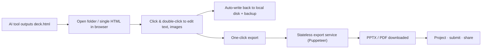

<div align="center">

# HTML Deck Studio

**Trim AI-generated HTML decks in your browser, then export pixel-perfect PPTX / PDF in one click.**

English | [简体中文](README.zh-CN.md)

[](LICENSE)
[](#contributing)


</div>

> Your AI tool already writes beautiful `deck.html`. This is the missing last mile: edit it like a doc, ship it as a slide.

<!-- TODO: replace with a real demo GIF. A 10s loop of "open folder → click to edit a title → export PPTX" is worth more than this whole README. -->
<div align="center">
  
  <br />
  <sub>Demo placeholder · drop a <code>demo.gif</code> into <code>docs/assets/</code></sub>
</div>

## Why this exists

In the last 18 months, "let the AI write the slides as HTML" quietly became a real workflow. Cursor / Claude / ChatGPT are great at Flex/Grid layouts, KaTeX, Mermaid and custom fonts — and terrible at native PowerPoint XML. So people generate a gorgeous `deck.html` instead of fighting Keynote.

Then three problems show up, every single time:

- **Last-minute edits hurt.** The night before the talk your advisor says "change that one line on slide 16." Now you're back in the AI tool: prompt, wait, diff, save. Once is fine. The tenth time you want to scream.
- **Projectors want PPT/PDF.** Schools require a `.pptx` upload, clients want a `.pdf`, and raw HTML on a projector loves to drop fonts or stall on the network.
- **Privacy anxiety is real.** Thesis defenses, client proposals, internal decks — people don't want to upload any of it to an online editor.

HTML Deck Studio does exactly one thing well: **take HTML you already have, let you point-and-edit it in the browser, and export an industrial-grade PPT/PDF — without your files ever leaving your machine.**

It is *not* an AI slide generator, not another DSL like reveal.js / Slidev, not a cloud editor. It's a pair of scissors for AI decks.

## Quick start

```bash
# 1. install
pnpm install

# 2. run web app + stateless export service
pnpm dev
# web → http://localhost:5173   api → http://localhost:3000
```

Then, in a Chromium browser (Chrome / Edge / Brave / Arc):

1. **Open** a folder that contains your `deck.html` (with images/assets), or just drag in a single self-contained `.html`.
2. **Edit** — click any element to tweak font / color / size, double-click text to edit inline, drop a new image to replace one, or flip to **Code** mode for raw HTML.
3. **Export** — pick PPTX or PDF, choose a resolution (up to 4K), download. Done.

Your edits are written back to disk automatically (debounced), with timestamped snapshots in `.hds-backup/` so you can never trash the original.

## How it works

Two pieces: a browser SPA that does all the editing, and a stateless service that only shows up at export time and forgets everything the moment it's done.



- **Editing** lives entirely in the browser via the File System Access API — read, edit, write, never upload.
- **Export** ships the deck to a short-lived Puppeteer worker that screenshots each slide at high DPI, builds the PPTX/PDF, returns it, and wipes the temp files. No database, no object storage.

## Features

- **Point-and-edit, no DSL.** Any `<section class="slide">` deck works. Click to select, double-click to edit text inline, property panel for font / weight / color / align / underline / strikethrough / link.
- **Mermaid, rendered live.** Write raw Mermaid source; it renders in the editor and stays crisp in the export.
- **High-fidelity export.** Image-based PPTX / PDF that looks exactly like your HTML. Standard 2560×1440 up to 4K, single page / ranges supported.
- **Two ways in.** A folder (reads/writes sibling images, keeps backups) or a single self-contained HTML file (saved as a copy, images inlined as base64).
- **Local-first & private.** Files stay on your disk. The server only touches your content for the seconds it takes to export, then destroys it.
- **Code mode.** Monaco editor for the current slide when you want raw control, with validation before it commits.

## Browser support

The editor needs the File System Access API, which today means Chromium-based browsers.

| Browser | Folder mode | Single-file mode |
| --- | --- | --- |
| Chrome / Edge / Brave / Arc / Opera | Yes | Yes |
| Safari / Firefox | Not yet (ZIP fallback planned) | Not yet |

## Privacy

This is the whole point, so it's worth saying plainly: **during editing, your data never leaves your machine.** The only moment a file touches a server is when you click export — it lives in a temp dir for a few dozen seconds and is deleted right after. Nothing is persisted, nothing is trained on.

## Roadmap & growth

- [docs/ROADMAP.md](docs/ROADMAP.md) — what's next and why, prioritized.
- [docs/GROWTH.md](docs/GROWTH.md) — positioning, channels and how we plan to grow it.
- [docs/PRD.md](docs/PRD.md) · [docs/TRD.md](docs/TRD.md) — product and technical specs.

## Contributing

This started as a tool I wanted for myself, and the best version of it will come from people who actually live this workflow. Issues and PRs are the way — async beats chat groups for open source.

Please feel free to use and contribute to the development. If it saves you one painful night before a talk, that's already worth it.

## License

[MIT](LICENSE)
