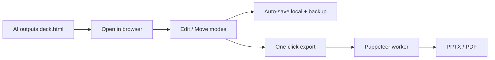

<div align="center">


# NextPPT

**The next PPT — edit AI-generated HTML decks in your browser, then export pixel-perfect PPTX / PDF in one click.**

English | [简体中文](README.zh-CN.md)

[](LICENSE)
[](#contributing)


</div>

> Your AI tool already writes beautiful `deck.html`. NextPPT is the missing last mile: click to fix one word, drag to rearrange, ship it as a slide — without another prompt round.

<div align="center">
  
  <br />
  <sub>Demo placeholder · drop a <code>demo.gif</code> into <code>docs/assets/</code></sub>
</div>

## Why this exists

"Let the AI write the slides as HTML" is a real workflow now. Cursor / Claude / ChatGPT nail Flex layouts, KaTeX, Mermaid and custom fonts — and still struggle with native PowerPoint XML. So people ship a gorgeous `deck.html` instead of fighting Keynote.

Then the same three problems show up:

- **Last-minute edits hurt.** Your advisor says "change that one line on slide 16." You're back in the AI tool: prompt, wait, diff, save. Once is fine; the tenth time you want to scream.
- **Projectors want PPT/PDF.** Schools require `.pptx`, clients want `.pdf`, and raw HTML on a projector loves to drop fonts or stall on the network.
- **Privacy anxiety is real.** Thesis defenses, client proposals, internal decks — people don't want to upload any of it to an online editor.

**NextPPT** does one thing well: take HTML you already have, let you point-and-edit it in the browser, and export high-fidelity PPT/PDF — **without your files ever leaving your machine.**

It is *not* an AI slide generator, not another DSL like reveal.js / Slidev, not a cloud editor. It's a pair of scissors for AI decks.

## Quick start

```bash
pnpm install
pnpm dev
# web → http://localhost:5173   api → http://localhost:3000
```

In a Chromium browser (Chrome / Edge / Brave / Arc):

1. **Open** — pick a folder with your `deck.html` and assets, drag in a single `.html`, or try the built-in sample on the home page.
2. **Edit** — **Edit** mode: click text, tweak fonts/colors in the panel, double-click to type inline. **Move** mode: drag, resize, stack layers like PowerPoint — no code.
3. **Export** — PPTX or PDF, up to 5120×2880, page ranges supported. Done.

Edits auto-save to disk (debounced) with timestamped snapshots in `.hds-backup/`.

New here? Open **Guide** from the nav bar — copy a prompt, let AI generate a deck, then come back and open it.

## How it works

A browser SPA handles all editing; a stateless service only appears at export time and forgets everything when it's done.



- **Editing** uses the File System Access API — read, edit, write, never upload.
- **Export** screenshots each slide at high DPI, builds PPTX/PDF, wipes temp files. No database, no object storage.

## Features

- **Point-and-edit.** Any `<section class="slide">` deck works. Property panel for font, weight, color, align, decoration, links, images.
- **Edit / Move modes.** Edit = text only, calm. Move = freeform drag, resize, layer order (bring forward, send back) — like native PPT.
- **Mermaid, live.** Raw Mermaid source renders in the editor and stays crisp in export.
- **High-fidelity export.** Image-based PPTX / PDF that matches your HTML. Up to 5120×2880; single page or ranges.
- **Bilingual UI.** Chinese / English across the site, guide, and editor.
- **Two ways in.** Folder mode (sibling images + backups) or single self-contained HTML (base64 images).
- **Local-first.** Files stay on disk; the server only touches content for the seconds it takes to export.

## Browser support

| Browser | Folder mode | Single-file mode |
| --- | --- | --- |
| Chrome / Edge / Brave / Arc / Opera | Yes | Yes |
| Safari / Firefox | Planned (ZIP fallback) | Planned |

## Privacy

**During editing, your data never leaves your machine.** Export sends content to a temp worker for a few dozen seconds, then deletes it. Nothing persisted, nothing trained on.

## Docs

- [docs/ROADMAP.md](docs/ROADMAP.md) — what's next
- [docs/GROWTH.md](docs/GROWTH.md) — positioning and channels
- [docs/PRD.md](docs/PRD.md) · [docs/TRD.md](docs/TRD.md) — product & technical specs

## Contributing

Built for people who live this workflow. Issues and PRs welcome — if it saves you one painful night before a talk, that's already worth it.

## License

[MIT](LICENSE)
