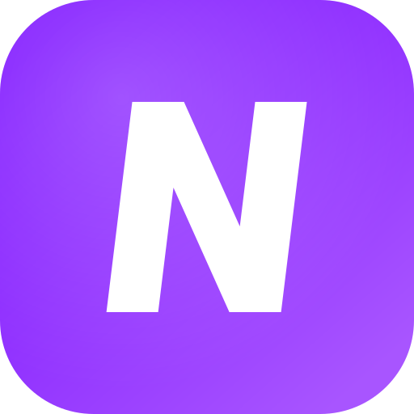
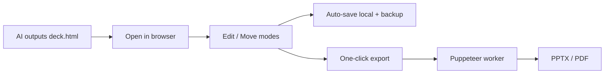

<div align="center">



# NextPPT

**The next PPT — edit AI-generated HTML decks in your browser, then export pixel-perfect PPTX / PDF in one click.**

English | [简体中文](README.zh-CN.md)

[](LICENSE)


</div>

## A note on shutting down

`next-ppt.com` **is no longer operated or maintained.** The repo stays MIT; if you want the tool, **clone it and run it locally** (see Quick start).

I meant this. Take an HTML deck the AI already wrote, click to edit it in the browser, export something you can actually present — I thought that was the last mile, and for a few people it was. The public site never found many users. Meanwhile Feishu, Lark, and every other big platform are wiring AI into docs, meetings, and slides faster than a solo developer can keep up. They have distribution, accounts, and a button people already click every day. On that workflow, a personal site is unlikely to become the default. Keeping a server on for a page almost nobody opens is not a strategy.

So it stops. Not because the idea suddenly had no value — because this is no longer a race a person should run against the platforms.

If you are also trying to turn an idea into something that can feed you, here is what I would tell myself next time: **do not compete with the AI workflows the giants have already noticed.** They will catch up; it is only a matter of time. Solo builders are better off in the corners those companies ignore — small, specific problems where someone will pay for an outcome, not for "another platform." Get a tiny loop closed: who shows up, why they stay, how money comes in, how you deliver. The way through is not a bigger model. It is a narrower problem and a loop you actually own.

> **The world has never lacked smart people, and never lacked ideas. What it lacks are people who know their own edge.** Find a small circle, stand up a service, grow your influence, and slowly widen the radius of rules you get to write. That is the reluctant — and only walkable — path for a small founder.

NextPPT stays here as code. The hosted site will not. Forks welcome.

---

> Your AI tool already writes beautiful `deck.html`. NextPPT is the missing last mile: click to fix one word, drag to rearrange, ship it as a slide — without another prompt round.

<div align="center">
  
  <br />
  <sub>Open an AI-generated deck, click to edit, export PPTX / PDF — all local.</sub>
</div>

## Why this exists

"Let the AI write the slides as HTML" is a real workflow now. Cursor / Claude / ChatGPT nail Flex layouts, KaTeX, Mermaid and custom fonts — and still struggle with native PowerPoint XML. So people ship a gorgeous `deck.html` instead of fighting Keynote.

Then the same three problems show up:

- **Last-minute edits hurt.** Your advisor says "change that one line on slide 16." You're back in the AI tool: prompt, wait, diff, save. Once is fine; the tenth time you want to scream.
- **Projectors want PPT/PDF.** Schools require `.pptx`, clients want `.pdf`, and raw HTML on a projector loves to drop fonts or stall on the network.
- **Privacy anxiety is real.** Thesis defenses, client proposals, internal decks — people don't want to upload any of it to an online editor.

**NextPPT** does one thing well: take HTML you already have, let you point-and-edit it in the browser, and export high-fidelity PPT/PDF — **without your files ever leaving your machine.**

It is *not* an AI slide generator, not another DSL like reveal.js / Slidev, not a cloud editor. It's a pair of scissors for AI decks.

## Quick start

Requires Node.js 20+ and [pnpm](https://pnpm.io) 10+. Export needs Chrome on the machine, or the Chromium Puppeteer downloads during `pnpm install`.

```bash
git clone https://github.com/Trade-Offf/NextPPT.git
cd NextPPT   # or html-deck-studio
pnpm install
pnpm dev
# web → http://localhost:5173   api → http://localhost:3310
```

Open `http://localhost:5173` in a Chromium browser (Chrome / Edge / Brave / Arc — editing uses the File System Access API). In dev, export goes through Vite's `/v1` proxy to local `:3310`. **Do not** set `VITE_API_BASE` (that used to point at the public API).

1. **Open** — pick a folder with your `deck.html` and assets, drag in a single `.html`, or try the built-in sample on the home page. Open a file that isn't a valid deck and you get a clear inline hint that links straight to the guide's prompt — no silent failure.
2. **Edit** — **Edit** mode: click text, tweak fonts/colors in the panel, double-click to type inline. **Move** mode: drag, resize, and reorder layers (bring to front / send to back, forward / backward one step) like PowerPoint — no code. Entering Move mode auto-detects draggable elements, so anything is movable on the first try.
3. **Export** — PPTX or PDF, up to 5120×2880, page ranges supported. Done.

Edits auto-save to disk (debounced) with timestamped snapshots in `.hds-backup/`.

New here? Open the **Guide** from the nav bar — a three-step generate / edit / export walkthrough with a copy-ready prompt, switchable between English and Chinese.

## How it works

A browser SPA handles all editing; a stateless service only appears at export time and forgets everything when it's done.


```mermaid
flowchart LR
  ai["AI outputs deck.html"] --> open["Open in browser"]
  open --> edit["Edit / Move modes"]
  edit --> save["Auto-save local + backup"]
  edit --> export["One-click export"]
  export --> svc["Puppeteer worker"]
  svc --> file["PPTX / PDF"]
```

- **Editing** uses the File System Access API — read, edit, write, never upload.
- **Export** screenshots each slide at high DPI, builds PPTX/PDF, wipes temp files. No database, no object storage.

## Features

- **Point-and-edit.** Any `<section class="slide">` deck works. Property panel for font, weight, color, align, decoration, links, images.
- **Edit / Move modes.** Edit = text only, calm. Move = freeform drag, resize, and full layer ordering (to front / to back, forward / backward one step) — like native PPT. Move mode auto-extracts draggable elements, so you never have to "wake up" a layer first.
- **Mermaid, live.** Raw Mermaid source renders in the editor and stays crisp in export.
- **High-fidelity export.** Image-based PPTX / PDF that matches your HTML. Up to 5120×2880; single page or ranges.
- **Guided onboarding.** A built-in guide page walks generate → edit → export with a copy-ready AI prompt; opening a malformed file surfaces an inline hint that points you there instead of failing silently.
- **Bilingual UI.** Chinese / English across the site, guide, and editor, switchable anywhere.
- **Two ways in.** Folder mode (sibling images + backups) or single self-contained HTML (base64 images).
- **Local-first.** Files stay on disk; the server only touches content for the seconds it takes to export.

## Browser support

| Browser | Folder mode | Single-file mode |
| --- | --- | --- |
| Chrome / Edge / Brave / Arc / Opera | Yes | Yes |
| Safari / Firefox | Planned (ZIP fallback) | Planned |

## Privacy

**During editing, your data never leaves your machine.** Export sends content to a temp worker for a few dozen seconds, then deletes it. Nothing persisted, nothing trained on.

## Hosted site discontinued

There is no public instance. Run it locally with the Quick start above. Historical hosting notes live in [apps/web/DEPLOY.md](apps/web/DEPLOY.md) (archived — you do not need to deploy).

## Docs

- [apps/web/DEPLOY.md](apps/web/DEPLOY.md) — archived hosting notes
- [docs/ROADMAP.md](docs/ROADMAP.md) — what's next
- [docs/GROWTH.md](docs/GROWTH.md) — positioning and channels
- [docs/PRD.md](docs/PRD.md) · [docs/TRD.md](docs/TRD.md) — product & technical specs

## Contributing

Open source for self-host / local use. Forks welcome; this is no longer scheduled as a hosted product. If it saves you one painful night before a talk, that's already worth it.

## License

[MIT](LICENSE)
