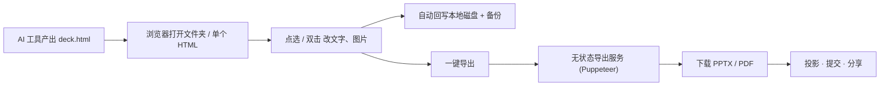

<div align="center">

# HTML Deck Studio

**把 AI 产出的 HTML 演示稿,在浏览器里点哪改哪,一键导出工业级 PPTX / PDF。**

[English](README.md) | 简体中文

[](LICENSE)
[](#参与贡献)


</div>

> 你的 AI 工具已经能写出很漂亮的 `deck.html`,缺的其实是最后一公里:像改文档一样改它,像幻灯片一样发它。

<!-- TODO: 换成真实 demo GIF。一个 10 秒的"打开文件夹 → 点一下改标题 → 导出 PPTX"循环,比这整篇 README 都管用。 -->
<div align="center">
  
  <br />
  <sub>演示占位 · 把 <code>demo.gif</code> 放到 <code>docs/assets/</code> 即可</sub>
</div>

## 为什么做这个

过去一年多,"让 AI 直接用 HTML 写幻灯片"其实已经变成一种很主流的工作方式。Cursor / Claude / ChatGPT 写 Flex/Grid 排版、KaTeX、Mermaid、自定义字体都很强,但写原生 PowerPoint 的那套 XML 始终很烂。所以大家干脆让 AI 产一个好看的 `deck.html`,而不是回去跟 Keynote 较劲。

然后每次都会撞上三个问题:

- **临场改一句话太难受。** 答辩前一晚导师说"第 16 页那句话改一下",你又得回到 AI 工具:发 prompt、等、看 diff、保存。一次还好,第十次真的想骂人。
- **投影还是要 PPT/PDF。** 学校要求交 `.pptx`,客户要 `.pdf`,而 HTML 直接上投影仪很容易掉字体、卡网络。
- **隐私是真的焦虑。** 答辩稿、客户方案、内部资料,大家都不太敢传到任何在线编辑器里。

HTML Deck Studio 只把一件事做好:**拿你已经有的 HTML,在浏览器里点哪改哪,再导出一份高保真的 PPT/PDF——而且文件全程不离开你本机。**

说白了,它不是 AI 生成 PPT,不是 reveal.js / Slidev 那种要重学语法的工具,也不是云端编辑器。它就是一把专门修剪 AI 演示稿的剪刀。

## 快速开始

```bash
# 1. 安装
pnpm install

# 2. 同时起前端 + 无状态导出服务
pnpm dev
# 前端 → http://localhost:5173   后端 → http://localhost:3000
```

然后用 Chromium 内核浏览器(Chrome / Edge / Brave / Arc):

1. **打开**:选包含 `deck.html`(和图片资源)的文件夹,或者直接拖进一个自包含的单个 `.html`。
2. **编辑**:点元素改字号/颜色/字重,双击文字行内编辑,拖图替换,或切到 **代码** 模式直接改 HTML。
3. **导出**:选 PPTX 或 PDF,挑分辨率(最高 4K),下载,搞定。

改动会自动防抖回写到磁盘,并在 `.hds-backup/` 留带时间戳的快照,原文件不会被你改坏。

## 它是怎么跑的

两块:一个浏览器 SPA 负责全部编辑;一个无状态服务只在导出那一下出现,事后立刻把一切忘掉。



- **编辑**全部在浏览器里,通过 File System Access API 读写本地文件,不上传。
- **导出**才把内容送到一个短命的 Puppeteer worker,高 DPI 逐页截图、拼成 PPTX/PDF、回吐文件,然后清掉临时目录。没有数据库,没有对象存储。

## 功能

- **点哪改哪,不学 DSL。** 任意 `<section class="slide">` 结构都能用。单击选中、双击文字行内编辑,属性面板支持字号/字重/颜色/对齐/下划线/删除线/链接。
- **Mermaid 实时渲染。** 直接写 Mermaid 源码,编辑期实时预览,导出依旧清晰。
- **高保真导出。** 图片型 PPTX / PDF,长得和你的 HTML 一模一样。标准 2560×1440,最高到 4K,支持单页/页码范围。
- **两种入口。** 文件夹(读写同级图片、保留备份)或单个自包含 HTML(另存为副本,图片以 base64 内联)。
- **本地优先、隐私友好。** 文件留在你磁盘上;服务端只在导出那几秒碰一下你的内容,随即销毁。
- **代码模式。** 想要原始控制时,用 Monaco 编辑当前页,提交前会做校验。

## 浏览器支持

编辑器依赖 File System Access API,目前意味着 Chromium 系浏览器。

| 浏览器 | 文件夹模式 | 单文件模式 |
| --- | --- | --- |
| Chrome / Edge / Brave / Arc / Opera | 支持 | 支持 |
| Safari / Firefox | 暂不支持(计划做 ZIP 兜底) | 暂不支持 |

## 隐私

这是整个产品的核心,所以直说:**编辑期间,你的数据不离开本机。** 唯一一次文件接触服务器,是你点导出的那下——它在临时目录里待几十秒就被删掉。不持久化,不拿去训练。

## 路线图与增长

- [docs/ROADMAP.md](docs/ROADMAP.md) — 后续要做什么、为什么,按优先级排好。
- [docs/GROWTH.md](docs/GROWTH.md) — 定位、渠道,以及打算怎么把它推出去。
- [docs/PRD.md](docs/PRD.md) · [docs/TRD.md](docs/TRD.md) — 产品与技术方案。

## 参与贡献

这东西最早是我自己想用才做的,而它最好的样子,一定来自真正天天用这个工作流的人。提 Issue、发 PR 就是最好的方式——开源用异步沟通比拉群靠谱。

Please feel free to use and contribute to the development. 如果它能帮你省下答辩前那一个难受的晚上,就已经值了。

## License

[MIT](LICENSE)
