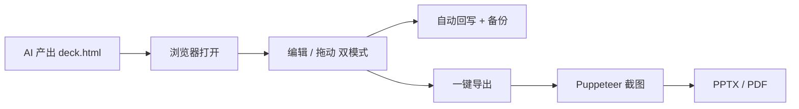

<div align="center">


# NextPPT

**下一代 PPT，从 HTML 开始 —— 把 AI 产出的 HTML 演示稿，在浏览器里点哪改哪，一键导出工业级 PPTX / PDF。**

[English](README.md) | 简体中文

[](LICENSE)


</div>

## 写在停运之前

`next-ppt.com` **已停止运营与维护。** 仓库仍 MIT 开源，想用的人请 **clone 到本机**（见下方快速开始）。

这件事是认真做过的。把 AI 写出来的 HTML 演示稿，在浏览器里点哪改哪、再导出能上台的 PPT——我以为这是「最后一公里」，也确实帮到过一些人。但公网挂着的这段时间里，用户始终很少；与此同时，飞书、Lark 以及更多大厂，把 AI 嵌进文档、会议、幻灯片的速度远比个人开发者能追的快。他们不缺流量、不缺账号体系、不缺「打开就能用」的入口。同一条工作流上，个人站很难再成为默认选项。继续烧服务器去守一个几乎没人来的线上站点，没有意义。

所以停了。不是产品突然没价值，是这条赛道已经不是个人该硬刚的地方。

如果这也是你正在走的路，想把一个 Idea 做成能养活自己的东西，我想把这句话留给你：**别去跟大厂抢他们已经看上的 AI 工作流。** 他们补能力只是时间问题。个人开发者更该盯那些大厂看不上、却能自己转起来的角落——够小、够具体，用户愿意为结果付钱，而不是为「又一个平台」付钱。先做成一个自己能闭环的小生意：谁来、为什么来、钱怎么进来、你怎么交付。杀出一条血路，靠的不是更大的模型，是更窄的问题和更完整的一小圈。

> **这世界从不缺聪明人，从不缺创意。缺的是认清自己优势的人。** 找到一个小圈子，把服务立住，把影响力养起来，一点点扩大你能定规则的范围——这才是中小创业者无奈、却唯一走得通的生存之道。

NextPPT 就停在这里。代码留下，线上不再维护。欢迎 fork 自用。

---

> 你的 AI 工具已经能写出很漂亮的 `deck.html`，NextPPT 补的是最后一公里：改一个字不用重开一轮对话，像 PPT 一样拖图层，本地导出能投影的幻灯片。

<div align="center">
  
  <br />
  <sub>打开 AI 生成的演示稿，点选编辑，一键导出 PPTX / PDF——全程本地。</sub>
</div>

## 为什么做这个

「让 AI 用 HTML 写幻灯片」已经是很多人的日常了。Cursor / Claude / ChatGPT 写排版、KaTeX、Mermaid、自定义字体都很强，但原生 PowerPoint 那套 XML 始终很烂。所以大家干脆让 AI 产一个好看的 `deck.html`。

然后每次都会撞上三个问题：

- **临场改一句话太难受。** 答辩前一晚导师说「第 16 页那句话改一下」，你又得回到 AI：发 prompt、等、看 diff、保存。一次还好，第十次真的想骂人。
- **投影还是要 PPT/PDF。** 学校要 `.pptx`，客户要 `.pdf`，HTML 直接上投影仪很容易掉字体、卡网络。
- **隐私是真的焦虑。** 答辩稿、客户方案、内部资料，大家都不太敢传到在线编辑器。

**NextPPT** 只把一件事做好：拿你已经有的 HTML，在浏览器里点哪改哪，再导出高保真 PPT/PDF —— **文件全程不离开你本机。**

它不是 AI 生成 PPT，不是 reveal.js / Slidev 那种要重学语法的工具，也不是云端编辑器。它就是一把专门修剪 AI 演示稿的剪刀。

## 快速开始

前置：Node.js 20+、[pnpm](https://pnpm.io) 10+。导出需要本机已安装 Chrome，或 `pnpm install` 时 Puppeteer 下载的 Chromium。

```bash
git clone https://github.com/Trade-Offf/NextPPT.git
cd NextPPT   # 或 html-deck-studio
pnpm install
pnpm dev
# 前端 → http://localhost:5173   后端 → http://localhost:3310
```

用 Chromium 内核浏览器打开 `http://localhost:5173`（Chrome / Edge / Brave / Arc；编辑依赖 File System Access API）。开发态导出走 Vite 代理 `/v1` → 本机 `:3310`，**不要**设置 `VITE_API_BASE`（那是当年打公网 API 的）。

1. **打开** — 选包含 `deck.html` 和图片的文件夹，拖入单个 `.html`，或在首页点「试用样例」。打开的文件若不是合法演示稿，会给出明确的行内提示并直达指南里的提示词，不会「点了没反应」。
2. **编辑** — **编辑**模式：点文字、右侧面板改字号颜色，双击行内输入。**拖动**模式：拖位置、拖角缩放、调层级（置顶 / 置底、上移 / 下移一层），像 PPT，不用写代码。进入拖动模式会自动提取可拖元素，任何元素第一次就能拖。
3. **导出** — 选 PPTX 或 PDF，最高 5120×2880，支持指定页码。搞定。

改动自动防抖回写磁盘，`.hds-backup/` 里留带时间戳快照，原文件不会被改坏。

第一次用？顶部导航进 **使用指南** — 生成 / 编辑 / 导出三步走，附可一键复制的提示词，中英文随时切换。

## 它是怎么跑的

浏览器 SPA 负责全部编辑；无状态服务只在导出时出现，事后立刻清掉一切。


```mermaid
flowchart LR
  ai["AI 产出 deck.html"] --> open["浏览器打开"]
  open --> edit["编辑 / 拖动 双模式"]
  edit --> save["自动回写 + 备份"]
  edit --> export["一键导出"]
  export --> svc["Puppeteer 截图"]
  svc --> file["PPTX / PDF"]
```

- **编辑**走 File System Access API，读写本地，不上传。
- **导出**高 DPI 逐页截图、拼文件、删临时目录。无数据库、无对象存储。

## 功能

- **点哪改哪。** 任意 `<section class="slide">` 结构都能用；属性面板支持字号、字重、颜色、对齐、装饰、链接、换图。
- **编辑 / 拖动双模式。** 编辑 = 只改字，界面安静；拖动 = 自由移动、缩放、完整层级排序（置顶 / 置底、上移 / 下移一层）。进入拖动模式自动提取可拖元素，不用先「唤醒」某个图层。
- **Mermaid 实时渲染。** 写源码即可预览，导出依旧清晰。
- **高保真导出。** 图片型 PPTX / PDF，和 HTML 长得一样；最高 5120×2880，支持单页/范围。
- **新手引导。** 内置使用指南页串起「生成 → 编辑 → 导出」，附可一键复制的 AI 提示词；打开格式不对的文件会给出行内提示并引导到指南，而不是默默失败。
- **中英双语。** 站点、指南、编辑器界面随处可切换。
- **两种入口。** 文件夹模式（同级图片 + 备份）或单个自包含 HTML（图片 base64 内联）。
- **本地优先。** 文件留在磁盘；服务端只在导出那几秒碰一下内容。

## 浏览器支持

| 浏览器 | 文件夹模式 | 单文件模式 |
| --- | --- | --- |
| Chrome / Edge / Brave / Arc / Opera | 支持 | 支持 |
| Safari / Firefox | 计划中（ZIP 兜底） | 计划中 |

## 隐私

**编辑期间，数据不离开本机。** 只有点导出时，内容在临时目录待几十秒就被删掉。不持久化，不拿去训练。

## 线上已停运

公网站点不再提供。若要自用，按上方「快速开始」在本机运行即可。历史托管说明见 [apps/web/DEPLOY.md](apps/web/DEPLOY.md)（已归档，不必再部署）。

## 文档

- [apps/web/DEPLOY.md](apps/web/DEPLOY.md) — 历史托管记录（已归档）
- [docs/ROADMAP.md](docs/ROADMAP.md) — 后续规划
- [docs/GROWTH.md](docs/GROWTH.md) — 定位与渠道
- [docs/PRD.md](docs/PRD.md) · [docs/TRD.md](docs/TRD.md) — 产品与技术方案

## 参与贡献

仓库开源自用。欢迎 fork；不再按线上产品排期收 PR。如果你靠它省下答辩前那一个难受的晚上，就已经值了。

## License

[MIT](LICENSE)
