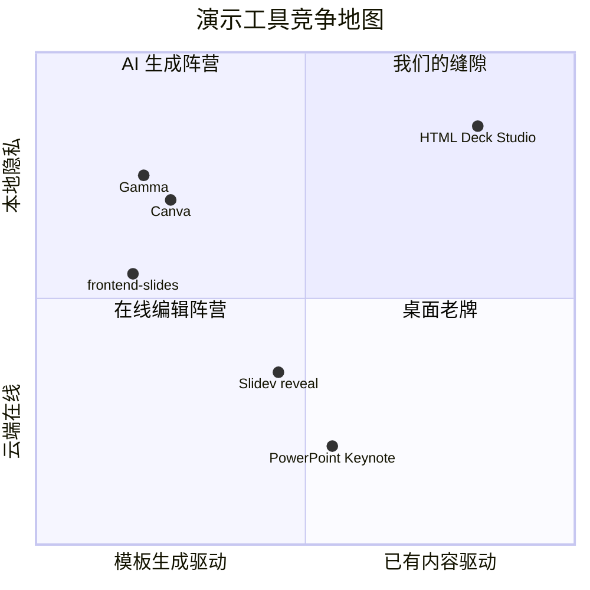
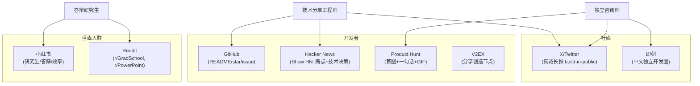
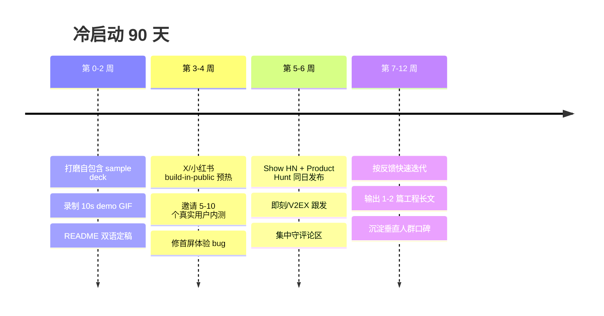
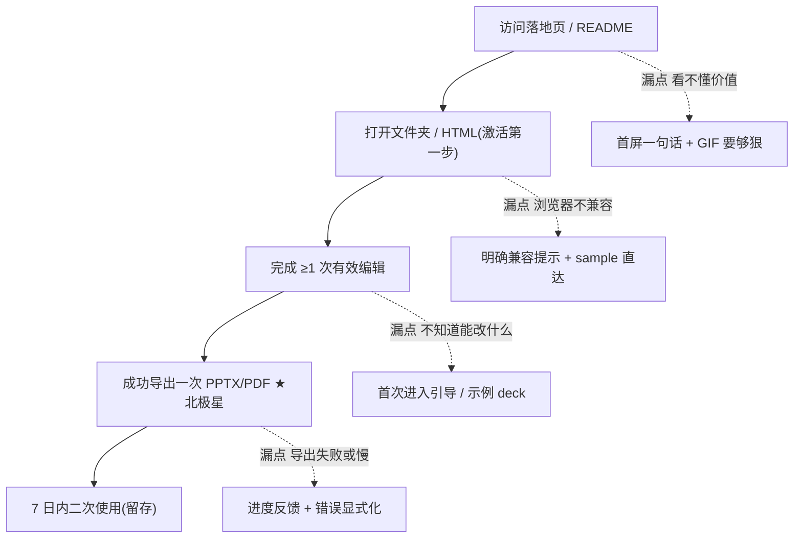
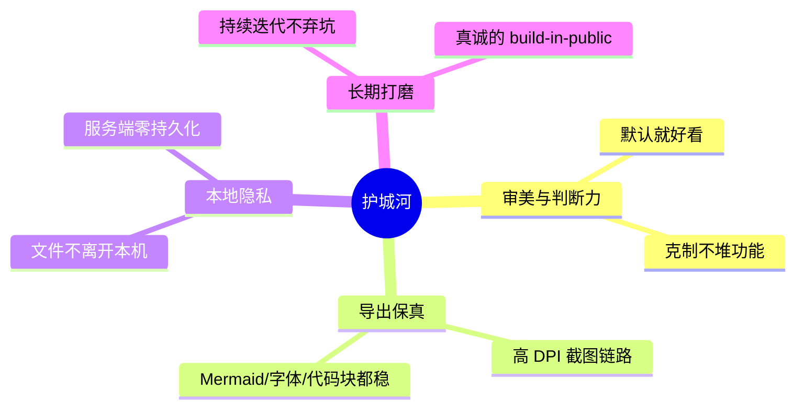

# 增长与运营思路 · GROWTH

> 视角:产品工程师 + 极简 + 长期主义。先想清楚"为谁、凭什么",再谈渠道和节奏。不追投放,靠产品力和真诚输出滚雪球。

本文档是 HTML Deck Studio 的 GTM(Go-To-Market)思路,服务于一个目标:**让真正被"AI 出 HTML 演示稿、却难改难导"折磨的人找到它,并且用一次就留下来。**

---

## 1. 定位与楔子(wedge)

不跟 Gamma / Canva / Slidev 正面打。它们各有强大的腹地:

**楔子很窄,故意的:** 只吃"你已经有一份 HTML deck,怎么改、怎么导"这一刀。
- 上游不管 HTML 怎么来(任何 AI 工具都行),不抢生成这块红海。
- 下游死守"高保真导出 + 本地隐私"这块别人懒得做或做不动的脏活。

窄定位的好处是:一句话能说清,用户一看就知道"是不是给我用的"。

**关于 frontend-slides(20K star):它是上游,不是竞品。** 它是 agent skill,负责"生成"`deck.html`;我们是 app,负责"改 + 导"。它生成的漂亮 deck 正是我们的理想供给。star 量级差异来自**形态(skill vs app)**——skill 的 repo 就是使用入口,用即 star;app 用户在浏览器用完即走。详见 [STRATEGY-SKILL-FLYWHEEL.md](STRATEGY-SKILL-FLYWHEEL.md)。

**因此定位升级为"双形态":** skill 当获客/star 入口(生成 NextPPT-ready deck),app 当价值兑现与留存。两者咬合,把结构性的 star 劣势转成上游流量入口。

---

## 2. ICP(理想用户画像)

复用 PRD 的三类人,每类配一句直接戳痛的钩子文案。

| ICP | 场景 | 钩子文案 |
| --- | --- | --- |
| 答辩研究生 | 用 AI 写好答辩 HTML,导师让临时改字、学校要交 pptx | "答辩前一晚改一句话,不用再回去求 AI 重跑。" |
| 做技术分享的工程师 | 手写/AI 生成的 HTML slides,要在会议室投影 | "你的 Mermaid 和代码块,导出后还是清晰的。" |
| 独立咨询 / 自由职业者 | 给客户的方案不想传任何在线编辑器 | "客户方案不离开你的电脑,导出照样精致。" |

共同点:**已经在用 HTML 做 deck,且对"改"和"导"有真实痛感。** 不试图教育"还没开始用 HTML 的人"——那是更慢的仗。

---

## 3. 渠道 × 人群映射

不同渠道住着不同的人,内容要分别裁剪,而不是一篇通稿到处发。

要点:
- **GitHub 是主场**:README 就是落地页,star 是信任货币,issue 是路线图。
- **Hacker News / Product Hunt 是放大器**:一次性流量,要攒足 demo 和故事再上,别浪费首发。
- **小红书 / Reddit 垂直人群转化最高**:答辩研究生的痛最尖锐,文案直接说"答辩前改一句话"。
- **X / 即刻 做长期人设**:build-in-public,持续晒踩坑和迭代,而不是发一次广告。

---

## 4. 冷启动节奏

不要一上来就 Product Hunt。先把"一个人就能完整体验"的 demo 打磨到无可挑剔,再放大。

发布日纪律:
- 一切围绕**一张好图 / 一个好 GIF**。推广效果强依赖它,缺图等于没发。
- 发布当天只做一件事:**守评论区**,30 分钟内回复每一条,把首发流量转成 star 和 issue。

---

## 5. 内容引擎:输出为王

最稳的增长不是投放,是**把"为什么做 + 工程踩坑"写成长文**,让内容长期带流量。可复用的选题:

- 《为什么 AI 写不好 PPTX,却很会写 HTML deck》——讲清品类存在的理由,天然带认同。
- 《用 Puppeteer 把 HTML 高保真导成 PPT 踩的坑》(`__name` shim、Mermaid 等待、CJS 导入)——工程向硬货,HN 友好。
- 《File System Access API:做一个不上传文件的本地优先 Web 工具》——隐私叙事 + 技术干货。

一篇好长文 = 一次 HN 首页机会 + 长尾 SEO + 个人品牌沉淀,远比一条广告值钱。

---

## 6. 北极星与漏斗

北极星指标对齐 PRD §11:**完成"打开 → 编辑 → 导出"闭环的用户占比(Activation)。** 不看虚荣的 PV,看有多少人真正走通了一次价值闭环。

每个漏点都对应 ROADMAP 里的一条优化,增长和产品在这里咬合。

---

## 7. 定价叙事

长期主义意味着**先把信任攒够,再谈钱**,且永远不卡住核心体验。

- **免费够用**:打开、编辑、标准分辨率导出永久免费。
- **先放开不卡用户**:高分辨率(4K)、批量导出当前阶段全开,把口碑做厚。
- **后期按量**:匿名额度用满后,用 license key 解锁更多导出额度(对齐 PRD §10 的 Stripe Checkout + IP 限流方案),不做账号体系,不做订阅绑架。
- **叙事**:"工具该有的样子是帮你干活,不是设卡收费。" 商业化只对重度/商用场景收手续费式的钱。

---

## 8. 护城河

不是技术秘密,套壳谁都会。真正的壁垒是**别人懒得做或做不持久的组合**:

在"AI 套壳泛滥"的环境里,**审美 + 导出保真 + 隐私承诺 + 长期可信** 这四样叠起来,就是别人短期抄不走的东西。

---

## 待补充(诚实说明)

- 真实 GitHub repo URL、Product Hunt 链接、演示 GIF/截图需补充。
- 落地页转化数据、各渠道 ROI 需上线后用真实数据回填,本文先给框架与假设。
