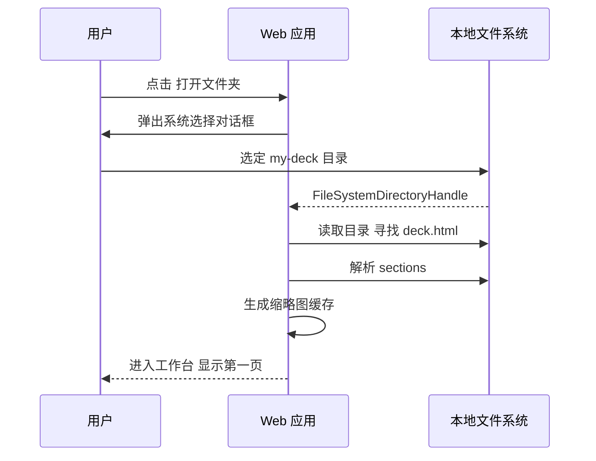
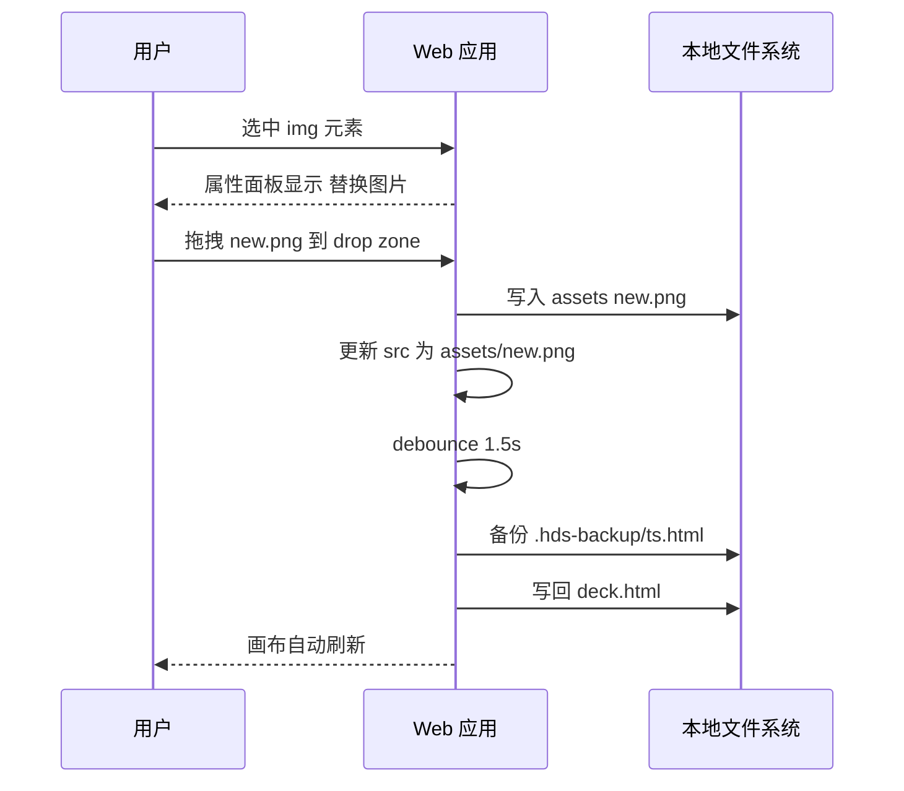
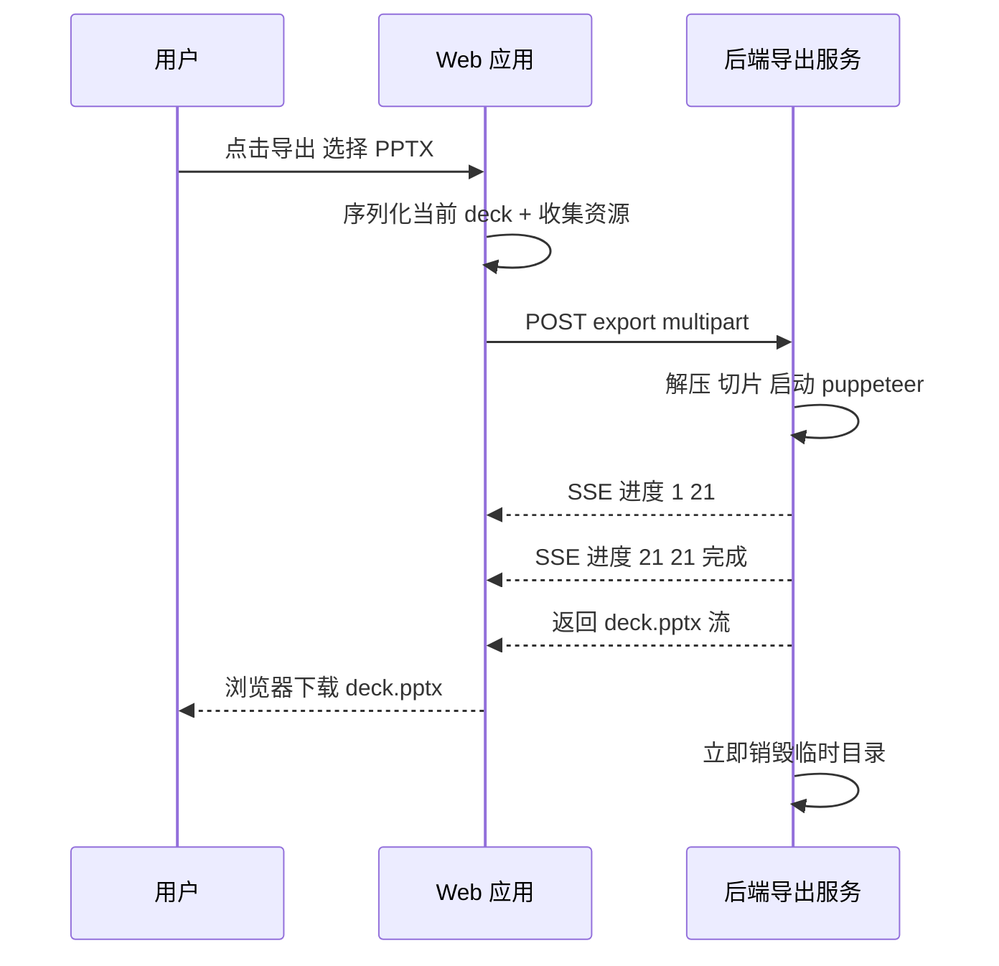
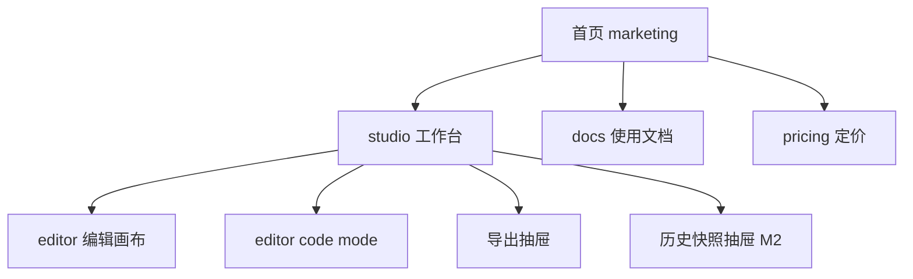
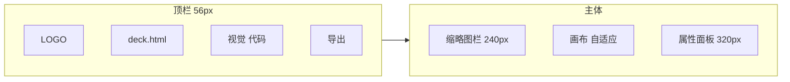

# HTML Deck Studio · 产品需求文档（PRD）

| 字段 | 内容 |
| --- | --- |
| 文档版本 | v0.1 (Draft) |
| 发布日期 | 2026-05-28 |
| 文档状态 | 评审中 |
| 产品负责人 | TBD |
| 关联文档 | [TRD.md](TRD.md) · [README.md](README.md) |
| 适用范围 | v1 MVP（M1）+ v2/v3 演进概要 |

---

## 1. 背景与机会

### 1.1 行业现状

过去 18 个月，AI 编程助手（Cursor / Claude Code / ChatGPT / Codex / Copilot）已经把"用 HTML+CSS 生成视觉精美的演示稿"变成一种主流工作方式。研究生答辩、技术分享、产品评审、教学课件，越来越多人选择让 AI 直接产出一个完整的 `deck.html`，而非使用 PowerPoint / Keynote / Slidev / reveal.js 等传统工具。

原因显而易见：

- **AI 写 HTML 强、写 PPT 弱**：AI 可以稳定生成现代审美的 Flex/Grid 排版、KaTeX 公式、Mermaid 图表、动效，而原生 PPTX 的 OOXML 结构 AI 始终写不好。
- **HTML 视觉天花板高**：CSS 变量、字体、阴影、渐变、自定义图标，做出来的页面观感远超大多数 PPT 模板。
- **代码可控**：AI 改一句话比改 PPT 里的文本框靠谱得多。

### 1.2 痛点

但这种工作流也带来三个尖锐痛点：

1. **微调成本高**：演示稿做好后，临场要把"对一致性的关联分析"改成"对一致性的影响分析"——用户得回到 AI 工具发 prompt、等响应、Diff、保存。一次不爽，十次崩溃。
2. **投影刚需是 PPT/PDF**：学校答辩要求提交 PPT，客户分享要求 PDF，HTML 在投影仪上经常字体缺失、网络卡顿。
3. **隐私焦虑**：论文答辩、客户方案、内部资料，用户不愿把 HTML 上传到任何在线编辑器，担心被训练或泄漏。

### 1.3 市场机会

- **数量级**：2026 年仅 GitHub 上 `class="slide"` 关键字相关仓库已超 1.2 万；活跃 AI 编程助手用户全球估算 800 万+，其中演示稿是高频使用场景之一。
- **付费意愿**：研究生答辩季、咨询提案、技术大会三个高峰每年覆盖数千万 PPT 需求，单次导出付费 1–3 美元的支付意愿明确。
- **竞品空白**：Slidev / Marp 解决"从代码到 PPT"，但锁定自家语法；Gamma / Tome 解决"AI 生成 PPT"，但不接 HTML；没有竞品聚焦"已经有 HTML，怎么微调和导出"这个具体环节。

---

## 2. 产品定位

### 2.1 一句话定位

> HTML Deck Studio 是一把专门修剪 AI 演示稿的剪刀：让 AI 产的 `deck.html` 在网页里点哪改哪，一键导出工业级 PPT / PDF。

### 2.2 价值主张

| 维度 | 价值 | 对比 |
| --- | --- | --- |
| 接入成本 | 零迁移：直接读 AI 产物，不限模板/语法 | Slidev/Marp 需重写为自家 DSL |
| 编辑体验 | 浏览器内点选 + 行内编辑 + 属性面板 | 现状：回到 AI 工具发 prompt |
| 导出质量 | 1280×720@2x 高清 PPT，视觉与 HTML 一致 | AI 直出 PPTX 排版差，html-pdf 字体糊 |
| 隐私 | 文件夹直读 + 服务端零持久化 | 在线编辑器需要上传保存 |
| 价格 | 匿名免费导出 + 按量付费 | 全功能 SaaS 月订成本高 |

### 2.3 差异化

我们**不做**：

- AI 生成 HTML（用户自己有 AI 工具）
- AI 重写文案（编辑文本应纯人工以避免误改）
- 大段结构重排（v1 保持 HTML 拓扑稳定，仅改文字/属性/图片）
- 主题/模板市场（v1 不锁定视觉规范）
- 多人实时协作（v1 单机即用）

我们**坚决做**：

- 任意 HTML 兼容（KaTeX、Mermaid、自定义字体、CSS 变量、复杂 Flex 布局）
- 像 IDE 一样的本地文件夹直连
- 像截图工具一样稳定的 PPT 导出
- 像 PDF24 一样轻的访问门槛

---

## 3. 用户画像与场景

### 3.1 核心人群

#### Persona 1：研究生 · 陈智豪（高频付费）

- 26 岁，硕士三年级，正在准备答辩
- 已用 Cursor 让 AI 生成了 21 页 `bilayer-network-slides.html`
- 答辩前一晚导师说"第 16 页那句话改一下"
- 现状：打开 Cursor → 找到文件 → 发 prompt → 等待 → 检查 → 再导出
- 期望：浏览器里点开那行字，改完 → 导出 PPTX 给学院系统

#### Persona 2：算法工程师 · 王悦（中频高单价）

- 30 岁，技术分享高频出席者
- 周五要在公司 tech talk 讲 LLM 应用，已让 Claude 写好 HTML
- 当天上午想插入两张新图、改三行标题
- 现状：本地 VSCode 改源码，浏览器预览，最后用截图工具凑 PPT
- 期望：拖文件夹进站 → 改完 → 一键导出无水印 PPT

#### Persona 3：独立咨询师 · 林霏（中频高客单）

- 35 岁，给企业做 AI 战略咨询
- 提案 80% 是 ChatGPT 产的 HTML，重视隐私
- 现状：客户要 PPT 版本，自己手动 PPT 重做一遍
- 期望：服务端不存内容、本地直读，一键导出客户可二次打开的文件

### 3.2 典型场景与频次

| 场景 | 触发频次 | 期望耗时 |
| --- | --- | --- |
| 临场改一两句话 + 导出 | 每周 1–3 次 | < 3 分钟 |
| 替换 2–5 张图 | 每周 1 次 | < 5 分钟 |
| 调整页面顺序 / 复制页 | 每月 2–4 次 | < 5 分钟 |
| 把整套 HTML 转 PPT 投给客户 | 每月 1–3 次 | < 1 分钟（仅导出） |

### 3.3 非目标人群

- 从零开始做 PPT 的人（用 Canva / PowerPoint 更合适）
- 移动端制作者（v1 仅桌面 Chromium）
- 不接受 Chrome / Edge 的用户（v1.1 提供 ZIP 兜底）

---

## 4. 价值主张与差异化

### 4.1 北极星指标候选

- **WAU 中完成至少一次"上传 → 编辑 → 导出"闭环的用户比例（Activation Rate）**
- 目标：M1 上线 6 周后 ≥ 35%

### 4.2 竞品矩阵

| 维度 | HTML Deck Studio | Slidev | Marp | Gamma | Canva | PowerPoint Web |
| --- | --- | --- | --- | --- | --- | --- |
| 接受任意 HTML | ✅ | ❌（Vue DSL） | ❌（Markdown） | ❌（自家 schema） | ❌ | ❌ |
| 浏览器所见即所得 | ✅ | ❌（命令行） | ❌ | ✅ | ✅ | ✅ |
| 本地文件夹直读 | ✅ | ✅（CLI） | ✅（CLI） | ❌ | ❌ | ❌ |
| 高保真 PPTX 导出 | ✅（图片型） | 部分 | 部分 | ✅ | ✅ | ✅ |
| 不上传服务器持久化 | ✅ | ✅ | ✅ | ❌ | ❌ | ❌ |
| 上手成本 | < 1 分钟 | 1 小时 | 30 分钟 | 5 分钟 | 5 分钟 | 5 分钟 |

### 4.3 核心说服一句话

- 对工程师/学者：「你的 AI 工作流不变，只是多了一个修剪和导出的工具」
- 对企业用户：「你的文件不出本地磁盘」
- 对答辩学生：「五分钟搞定老师的最后一个意见」

---

## 5. 功能需求

### 5.1 功能优先级总表

| 编号 | 模块 | 功能 | M1 | M2 | M3 | M4 |
| --- | --- | --- | --- | --- | --- | --- |
| F-01 | 入口 | 拖拽 / 选择本地文件夹 | ✅ | | | |
| F-02 | 入口 | 上传单 HTML / ZIP（兜底） | | ✅ | | |
| F-03 | 解析 | 自动识别 `<section class="slide">` 切片 | ✅ | | | |
| F-04 | 编辑 | 缩略图侧栏（点击/拖拽排序） | ✅ | | | |
| F-05 | 编辑 | 1280×720 画布 iframe 渲染 | ✅ | | | |
| F-06 | 编辑 | 点选元素 + 行内编辑文字 | ✅ | | | |
| F-07 | 编辑 | 属性面板（字号 / 颜色 / 对齐 / 加粗 / 链接） | ✅ | | | |
| F-08 | 编辑 | 拖拽替换图片（写回 `assets/`） | ✅ | | | |
| F-09 | 编辑 | 页面级复制 / 删除 / 排序 | ✅ | | | |
| F-10 | 编辑 | 代码模式（Monaco）双向同步 | ✅ | | | |
| F-11 | 存储 | 实时回写本地文件（debounce 1.5s） | ✅ | | | |
| F-12 | 存储 | 自动备份快照（最多 50 份） | ✅ | | | |
| F-13 | 存储 | 历史恢复抽屉 | | ✅ | | |
| F-14 | 导出 | 一键导出 PPTX（1280×720@2x） | ✅ | | | |
| F-15 | 导出 | 一键导出 PDF（1280×720） | ✅ | | | |
| F-16 | 导出 | 4K PPTX / PDF | | | ✅ | |
| F-17 | 导出 | 自定义封面 / 页脚 / 元数据 | | ✅ | | |
| F-18 | 计费 | 匿名免费额度（IP 限频） | | ✅ | | |
| F-19 | 计费 | Stripe Checkout 兑换 license key | | | ✅ | |
| F-20 | 计费 | 月订 / 包月无限导出 | | | ✅ | |
| F-21 | 账号 | 可选邮箱账号 + 云端历史 | | | | ✅ |
| F-22 | 体验 | 浏览器兼容性检测 + 友好降级提示 | ✅ | | | |
| F-23 | 体验 | i18n 中英双语 | ✅ | | | |
| F-24 | 体验 | 暗色模式 | | ✅ | | |
| F-25 | 模板 | 示例 deck 一键打开 | ✅ | | | |
| F-26 | 模板 | 公开模板库 | | | | ✅ |
| F-27 | 兼容 | Mermaid 即时渲染（编辑期 + 导出期） | ✅ | | | |
| F-28 | 导出 | 单页 / 页码范围导出 | ✅ | | | |

### 5.2 v1 (M1) 功能详述

#### F-01 / F-03 入口与解析

- 首页顶部 CTA 按钮「打开本地文件夹」，调用 `showDirectoryPicker()`
- 也支持拖拽文件夹到首页空状态区
- 进入工作台后，遍历目录寻找首个含 `<section class="slide">` 的 `.html` 文件，识别为 deck
- 解析 `<section class="slide">` 集合，每个 section 作为一页
- 自动从 section 抓取缩略图（首屏渲染 → 缩略截图缓存在内存）

#### F-04 / F-05 缩略图与画布

- 三栏布局：左缩略图（240px）、中画布（自适应）、右属性面板（320px）
- 画布固定 1280×720，按容器自动缩放（fit）
- 选中元素时画布上叠加蓝色边框 + 八向 handle（v1 仅用于显示选区，不做拖拽）

#### F-06 / F-07 编辑能力

- 点击元素一次：选中 → 显示属性面板
- 双击文本元素：进入 contenteditable 内联编辑
- 属性面板字段：
  - 字号（数字输入 + 上下箭头）
  - 颜色（预设 8 色 + 取色器）
  - 字体粗细（Light / Normal / Bold）
  - 对齐（左/中/右/两端）
  - 文本装饰（下划线 / 删除线）
  - 链接（input + 打开新页 toggle）

#### F-08 图片替换

- 选中 `` 元素：属性面板出现「替换图片」区
- 支持点击选择 + 拖拽到 drop zone
- 文件被拷贝到原 deck 同级 `assets/` 目录，重名时追加 `-1`、`-2`
- `src` 自动更新为相对路径

#### F-09 页面级操作

- 缩略图 hover 出现 `…` 菜单：复制 / 删除 / 上移 / 下移
- 支持拖拽缩略图重新排序
- 操作后自动更新所有 `<section>` 的 `data-page` 序号 + `nav-page` 文本

#### F-10 代码模式

- 顶栏「视觉 / 代码」切换
- 代码模式仅编辑**当前页**的 `<section>` HTML，避免误改全局
- 保存时校验 HTML 是否仍含 `<section class="slide">` 根，无效则提示

#### F-11 / F-12 存储

- 任意编辑操作触发 debounce 1.5s 后写盘
- 写盘前在 `.hds-backup/` 写一份带时间戳的快照
- 快照数 > 50 时按时间清理最老的

#### F-14 / F-15 / F-28 导出

- 顶栏右上「导出」按钮 → 抽屉
- 选项：
  - 格式：PPTX / PDF
  - 分辨率：标准（1280×720@2x） / 高清（1920×1080@2x，灰色锁定为 Pro）
  - **范围（F-28）**：全部页（默认）/ 当前页 / 自定义页码（支持 `1,3-5,8`）
  - 包含水印：是 / 否（Free 默认开）
- 点击「开始导出」→ 进度条 → 浏览器下载
- 单页导出仍走相同管线；产物文件名追加范围标识，如 `deck-p3-5.pptx`

#### F-27 Mermaid 即时渲染

- 自动识别页面中的 Mermaid 节点：
  - `<pre class="mermaid">…</pre>`
  - `
…
`
  - 任意带 `data-mermaid` 属性的容器
- 编辑期：iframe runtime 在挂载页面后调用 `mermaid.run()` 渲染为 SVG；用户改文本后 debounce 重新渲染当前节点
- 代码模式：用户可直接编辑 Mermaid 源码，保存后回视觉模式自动重新渲染
- 导出期：后端 Puppeteer 在截图前等待页面内所有 `[data-mermaid-rendered="true"]` 标记 + `document.fonts.ready` 双信号到达
- 失败兜底：若 Mermaid 解析报错，在原位置以浅红边框展示「Mermaid 渲染失败：<错误信息>」占位，不阻断导出
- 不支持 Mermaid 主题在线切换（保留用户在源码里设定的 `%%{init}%%`）

### 5.3 v2 (M2) 功能详述

- **F-02 ZIP 兜底**：检测到 Safari / Firefox 时引导走 ZIP 上传模式（上传 ZIP → 在线编辑 → 下载新 ZIP）
- **F-13 历史恢复**：抽屉式列出 `.hds-backup/` 内全部快照，点任意快照可"恢复 / 对比 / 删除"
- **F-17 元数据自定义**：导出抽屉新增"作者 / 标题 / 描述"字段写入 PPTX 元数据
- **F-18 匿名免费额度**：未付费用户每日最多导出 3 次，超出引导付费
- **F-24 暗色模式**：跟随系统或手动切换
- **F-25 示例 deck**：首页提供 3 套示例（学术答辩 / 技术分享 / 商业提案）一键打开

### 5.4 v3 (M3) 功能详述

- **F-16 4K 输出**：分辨率提升到 3840×2160@2x，针对发布会 / 大屏
- **F-19 Stripe Checkout**：单次包（100 次 / 9 美元）、月订（19 美元 / 月）
- **F-20 License Key**：浏览器 localStorage 存 key，导出请求带 key 鉴权

### 5.5 v4 (M4) 功能详述

- **F-21 可选账号**：邮箱注册（非强制），登录后可云同步项目（仍走"用户主动上传"，默认不存）
- **F-26 模板库**：公共仓库 + 用户提交，复制即用

---

## 6. 用户旅程与关键流程

### 6.1 整体旅程

### 6.2 关键流程 1：首次打开文件夹

### 6.3 关键流程 2：图片替换

### 6.4 关键流程 3：导出 PPTX

---

## 7. 信息架构与交互

### 7.1 站点结构

### 7.2 工作台布局

### 7.3 交互细节规范

| 交互 | 触发 | 反馈 |
| --- | --- | --- |
| 选中元素 | 单击画布元素 | 蓝色 1px 实线边框 + 属性面板填充 |
| 内联编辑 | 双击文本元素 | 边框变 2px 虚线 + 显示插入符 + Esc 取消 |
| 提交编辑 | 点击外部 / 按 Cmd+S | 防抖写盘 + 顶栏闪烁绿点（保存提示） |
| 替换图片 | 拖拽到画布 | drop zone 浮层 + 加载圈 + 成功 toast |
| 撤销 | Cmd+Z | 从内存编辑栈回退（页内）+ 文件级走历史抽屉 |
| 切页 | 点击缩略图 / PgUp / PgDn | 画布淡入切换（150ms） |
| 导出 | 点击导出 | 抽屉 → 进度条 → 自动下载 |

### 7.4 视觉规范（v1）

- 字体：Inter / Noto Sans SC / Fira Code
- 主色：`#1d4ed8`（cobalt）
- 辅色：`#0c1e3c`（ink）、`#475569`（slate）、`#e2e8f0`（rule）
- 圆角：4 / 6 / 8 / 12px 四档
- 间距：4 的倍数

---

## 8. 浏览器兼容性与降级

### 8.1 兼容性矩阵

| 浏览器 | 版本 | File System Access API | 可用度 |
| --- | --- | --- | --- |
| Chrome | ≥ 109 | ✅ | 完整 |
| Edge | ≥ 109 | ✅ | 完整 |
| Brave | 最新 | ✅ | 完整 |
| Arc | 最新 | ✅ | 完整 |
| Opera | 最新 | ✅ | 完整 |
| Safari | 17+ | ❌ | M2 ZIP 兜底 |
| Firefox | 最新 | ❌ | M2 ZIP 兜底 |
| 移动端 | n/a | ❌ | v1 不支持 |

### 8.2 降级策略

- 站点首屏检测：`'showDirectoryPicker' in window`
- 不支持时：
  - v1：展示模态框「请使用 Chrome / Edge 以获得本地文件夹直读体验」+ 提供「下载 Chrome」链接
  - M2 起：提供「上传 ZIP 模式」按钮，体验等价但用户需上传 + 下载新 ZIP
- 移动端：路由 `/studio` 显示「请在桌面端使用」提示页

---

## 9. 非功能需求

### 9.1 性能指标

| 指标 | 目标 |
| --- | --- |
| 首屏 LCP | < 1.5s（marketing 页） |
| 文件夹加载 → 进入工作台 | < 2s（21 页 deck） |
| 缩略图全部生成完成 | < 5s（21 页） |
| 编辑操作 → 画布反馈 | < 100ms |
| 编辑操作 → 写盘完成 | < 2s（含备份） |
| 导出 21 页 PPTX P95 | < 45s |
| 导出 21 页 PDF P95 | < 30s |

### 9.2 隐私与合规

- 用户编辑期间所有数据停留在浏览器 + 本地磁盘
- 导出请求是唯一服务端接触用户内容的时机；文件在临时容器内驻留，导出完成后立即销毁
- 不收集 PII；产品分析仅匿名事件埋点
- 隐私政策与服务条款上线前由法务复核
- 准备好 GDPR / CCPA 通用文案

### 9.3 可用性

- SLA：v1 不承诺；M3 商业化后 99.5%
- 后端容器自动扩缩，无单点

### 9.4 可访问性

- WCAG 2.1 AA：键盘可达、对比度合规、ARIA 完整
- 工作台所有交互可键盘操作（Tab / Enter / Esc）

### 9.5 i18n

- 中英双语，使用 i18next；M4 开始接更多语种

### 9.6 可观测性

- 前端：PostHog 匿名事件（Activation、Edit、Export Success/Fail）
- 后端：OpenTelemetry 链路 + Sentry 错误上报

---

## 10. 商业模式与定价

### 10.1 定价方案

| 套餐 | 价格 | 内容 |
| --- | --- | --- |
| Free（匿名） | 0 | 每日 3 次导出，1280×720@2x，含右下角浅水印 |
| Pro 包 | 9 美元 | 100 次导出额度，6 个月有效，无水印，1080p |
| Pro 月 | 19 美元 / 月 | 无限导出，4K，优先队列 |
| Team（M4） | 49 美元 / 月 | 5 席位，私有模板库，SSO |

### 10.2 付费触发点

- 用户当日导出 ≥ 3 次时弹出付费引导
- 选择 4K / 无水印时强制付费
- 导出失败/重试不计入额度

### 10.3 收入预测（M3 上线后 12 个月）

| 指标 | 保守 | 中性 | 激进 |
| --- | --- | --- | --- |
| 月活 | 8,000 | 25,000 | 80,000 |
| 付费转化 | 1% | 2% | 3.5% |
| ARPU 月 | 12 美元 | 15 美元 | 18 美元 |
| MRR | 960 | 7,500 | 50,400 |

### 10.4 成本结构

- 后端导出：CPU 密集，按导出次数计 ≈ 0.02 美元/次
- 前端托管：Cloudflare Pages 免费层即可
- Stripe 抽成：2.9% + 0.3 美元/笔
- 域名 + 邮件 + Sentry + PostHog：约 200 美元/月

---

## 11. 度量指标与北极星

### 11.1 北极星

> Activation Rate = 当周完成至少一次"上传 → 编辑 → 导出"闭环的用户 / 当周访问 studio 的独立用户

目标：M1+6 周达到 35%。

### 11.2 漏斗

### 11.3 关键事件

| 事件 | 触发位置 |
| --- | --- |
| `home_view` | 首页加载 |
| `studio_enter` | 进入工作台 |
| `folder_open_success` | 文件夹授权并解析成功 |
| `edit_text` | 文本编辑提交 |
| `edit_image` | 图片替换成功 |
| `save_disk` | 写盘完成 |
| `export_start` | 用户点击导出 |
| `export_success` | 导出文件下载 |
| `export_error` | 任一阶段失败 |
| `paywall_view` | 触发付费引导（M3） |

---

## 12. 上线计划与里程碑

### 12.1 时间线

### 12.2 M1 周计划

| 周 | 主题 | 关键交付 |
| --- | --- | --- |
| W1 | 项目脚手架 + 切片协议 | 仓库初始化、TRD 协议落地、文件读写打通 |
| W2 | 编辑器骨架 | 缩略图、画布渲染、选区与 postMessage |
| W3 | 编辑能力 + 代码模式 | 属性面板、图片替换、Monaco |
| W4 | 导出 + 联调 | 后端 Puppeteer、PPTX/PDF、首版上线灰度 |

### 12.3 验收条件

M1 上线必须满足：

- 用 Chrome 打开包含 `bilayer-network-slides.html` 的目录，5 分钟内完成至少 3 处文字 + 2 处图片修改
- 一键导出 PPTX，视觉与现有 `bilayer-network-slides.pptx` 一致
- 写盘后用 Cursor 重新打开 HTML，所有变更可见且合法
- 备份目录 `.hds-backup/` 有最近 5 份快照可还原

---

## 13. 风险与开放问题

### 13.1 风险登记

| 风险 | 等级 | 影响 | 缓解 |
| --- | --- | --- | --- |
| File System Access API 仅 Chromium | 高 | 30–40% 访客拒绝授权 | M2 ZIP 兜底 + 友好引导 |
| 用户改坏原文件 | 高 | 不可恢复→差评 | 写盘前快照 + 历史恢复抽屉 |
| 导出服务被爬虫滥用 | 中 | 成本失控 | Redis 限流 + Cloudflare Turnstile |
| 字体/KaTeX 加载慢致截图缺图 | 中 | 导出视觉异常 | 离线包预拉 + `fonts.ready` 等待 |
| 复杂 HTML 含 JS 与编辑器冲突 | 中 | 编辑器异常 | 编辑期禁脚本，渲染期开启 |
| Chrome 端 File System Access 配额触发 | 低 | 多次写盘失败 | 主动 prompt 重新授权 |
| 部分 KaTeX 公式渲染时机错位 | 低 | 截图为空 | 等待 `document.fonts.ready` + 显式 KaTeX render await |
| 服务端 PPTX 体积过大 | 低 | 下载慢 | 分辨率档位 + zip64 |

### 13.2 决策结论（原开放问题）

| # | 议题 | 决策 | 落地 |
| --- | --- | --- | --- |
| 1 | v1 是否兼容 Mermaid 即时渲染 | **兼容** | F-27 入 M1；详见 §5.2 · TRD §6.5 |
| 2 | 导出抽屉是否提供「单页导出」 | **支持** | F-28 入 M1；导出抽屉新增范围字段，详见 §5.2 · TRD §8.1 |
| 3 | 是否允许用户保存自定义调色板 | **不做** | 保留预设 8 色 + 取色器；未来若有强诉求再视为独立功能项 |
| 4 | 移动端是否提供「只看不编」预览 | **不做** | 移动端访问 `/studio` 路由仅显示「请使用桌面端」提示页 |

### 13.3 仍待回收的开放问题

- 后续基于真实流量决定：是否在导出抽屉里增加 "PDF 单页拆分" 选项（v1 暂走 zip 多文件） 

---

## 14. 附录

### 14.1 术语表

| 名词 | 含义 |
| --- | --- |
| Deck | 一份演示稿，对应一个 `deck.html` |
| Slide | 一页幻灯片，对应一个 `<section class="slide">` |
| HDS Slide Protocol | 我们与 AI 工具产物之间约定的 HTML 结构（详见 TRD） |
| 文件夹直读 | 通过 File System Access API 直接读写本地目录 |
| 图片型 PPT | 每页一张图填充的 PPTX，无可编辑文本对象 |
| 无状态导出 | 后端导出请求生命周期结束后立即销毁所有用户数据 |

### 14.2 参考链接

- File System Access API: <https://developer.chrome.com/docs/capabilities/web-apis/file-system-access>
- Puppeteer: <https://pptr.dev>
- pptxgenjs: <https://gitbrent.github.io/PptxGenJS/>
- 现有 demo: `/Users/zm00107ml/Downloads/figures/bilayer-network-slides.html`

### 14.3 FAQ（面向用户）

**Q: 我的 HTML 必须按你们的格式写吗？**
A: 只需保证幻灯片是 `<section class="slide">` 这种结构、画布 1280×720。AI 工具的输出几乎都已经满足。

**Q: 你们会保存我的 PPT 内容吗？**
A: 编辑期间数据在你浏览器与本地磁盘之间流动；导出期间数据在临时容器内驻留几十秒，结束后立即销毁。

**Q: Safari 能用吗？**
A: v1 只支持 Chrome / Edge / Brave / Arc 等 Chromium 系。M2 起 Safari / Firefox 可通过上传 ZIP 使用。

**Q: 导出的 PPT 能继续编辑吗？**
A: 每页是一张高清图，文字层不可在 PPT 内重新编辑；如需改字请回到本工具修改后重新导出。

**Q: 收费吗？**
A: M3 之前完全免费。M3 起匿名用户每日 3 次免费导出，超出可购买额度包。
