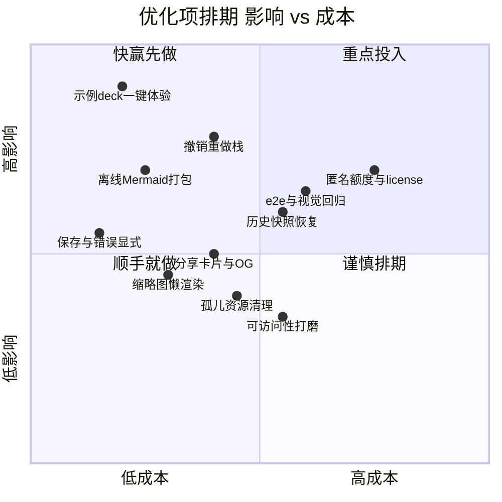
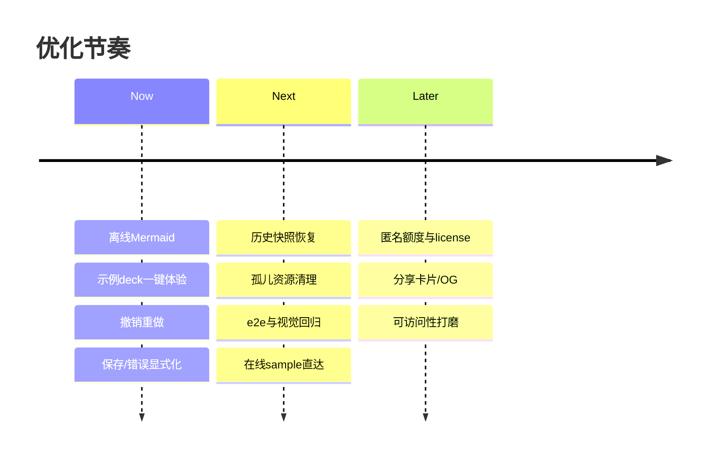

# 产品优化建议与路线图 · ROADMAP

> 排序原则(工程师的本能):**质疑 → 删除 → 简化 → 加速 → 自动化。** 先问"这功能真需要吗",能删就删,删不掉再简化,然后才谈加速和自动化。现状是 M1 已基本闭环(打开/编辑/导出走通),所以重心从"补功能"转向"打磨可信度与拉新"。

---

## 优先级总览:影响 vs 成本

---

## 1. Quick wins(本周可做,直接拉升激活)

| 项目 | 为什么 | 关联 |
| --- | --- | --- |
| **示例 deck 一键体验** | 拉新最强杠杆:首屏"无需准备文件,点一下试试",直接打掉"不知道能干嘛"的漏点 | PRD F-25 · GROWTH 漏斗 drop3 |
| **离线 Mermaid 打包** | 导出依赖 CDN 会抖动甚至失败;本地打包消除不确定性,导出更稳 | TRD 导出链路 |
| **保存状态 / 错误更显式** | 本地优先工具,用户最怕"我改的存了吗";状态清晰 = 信任 | GROWTH 漏斗 drop4 |
| **缩略图懒渲染** | 页数多时侧栏卡顿,懒渲染立竿见影,成本低 | 性能 |

## 2. 体验深水区(需要设计,但提升留存)

| 项目 | 为什么 | 关联 |
| --- | --- | --- |
| **撤销 / 重做栈** | 编辑器的基本尊严;没有它用户不敢大胆改 | 编辑体验 |
| **历史快照恢复抽屉** | `.hds-backup/` 已有快照,缺一个 UI 把它变成"后悔药",安全感拉满 | PRD F-13 |
| **孤儿资源清理** | 替换图片后旧文件残留,长期产生垃圾;提供检测+清理 | 资源管理 |
| **键盘可达性 / 可访问性** | 高频用户靠快捷键提速,也是品质信号 | A11y |

## 3. 增长相关(产品即获客)

| 项目 | 为什么 | 关联 |
| --- | --- | --- |
| **在线 sample 直达** | "拖个 HTML 试试"前先给一个能玩的样例,降低首次门槛 | GROWTH §6 |
| **分享卡片 / OG image** | 用户分享链接时有好看的预览图,自带传播力 | GROWTH §3 |

## 4. 商业化(M3,先攒信任再收钱)

| 项目 | 为什么 | 关联 |
| --- | --- | --- |
| **匿名额度 + license key** | 不做账号体系,IP 限流 + Stripe Checkout 兑换 license,只对重度/商用收费 | PRD §10 · GROWTH §7 |

## 5. 工程健康(让迭代不塌方)

| 项目 | 为什么 | 关联 |
| --- | --- | --- |
| **editor-runtime 单源** | 已修:运行时从虚拟模块单源注入,消除 stub 与真实逻辑双份 | 已完成 |
| **Playwright e2e + 视觉回归** | 导出保真是命根子,必须有自动化护栏防回归 | TRD §12 |

---

## 节奏:分三档推进

- **Now**:都是低成本高影响,直接咬合"激活漏斗"和"导出可信度",优先清空。
- **Next**:进入留存与工程护栏,让产品敢被更多人用、敢被频繁改。
- **Later**:商业化与长尾品质,等口碑和数据成熟再上,不提前透支用户信任。

---

## 决策原则速记

1. **每个新功能先问"能不能不做"**——删功能比加功能更难也更值钱。
2. **导出保真 > 一切花哨编辑能力**——这是品类立身之本,任何改动不能伤它。
3. **隐私承诺不可妥协**——本地优先是护城河,不为便利牺牲它。
4. **增长项与漏斗漏点一一对应**——不做"感觉有用"的功能,只做能堵住漏点的。

## 待补充(诚实说明)

- PRD 中部分功能编号(如撤销/重做对应的 F-?)需回填准确 ID。
- 各项工作量与排期为初估,需结合实际投入校准。
