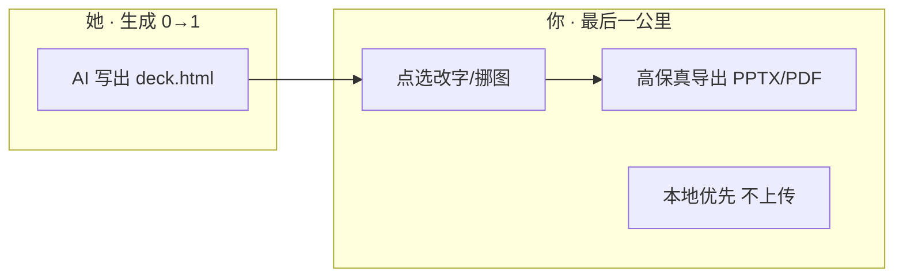
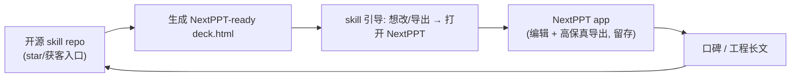

# 双形态飞轮战略 · 对标 frontend-slides（A+B）

> 视角:资深 AI 行业从业者 + 连续创业者。先把"star 差距的真因"说清楚,再决定打法。结论:不为 star 而 star,而是**开源一个 skill 把 star 重新变成"使用入口"**,同时把上游生成流量合法导进 app。

本文是 NextPPT 面对 [zarazhangrui/frontend-slides](https://github.com/zarazhangrui/frontend-slides)(20K+ star)的竞争策略。它不替代 [GROWTH.md](GROWTH.md)(GTM 框架)与 [ROADMAP.md](ROADMAP.md)(产品排期),而是给二者补上一条"靠 skill 形态撬动分发"的主线。

---

## 1. 判断:star 量级是"形态 × 渠道"的结构性差异,不是产品质量

先把情绪放下,做归因。她 20K、我们个位/十位数,差的不是做得好不好,而是**两件东西从根上就不同**:

| | frontend-slides(她) | NextPPT(你) |
| --- | --- | --- |
| 形态 | **Agent skill / Claude Code 插件**(一组 markdown) | **真实 web app**(前端编辑器 + Puppeteer 后端) |
| repo 的角色 | **就是产品的安装入口**——想用必须来 GitHub | **只是源码仓**——用户在浏览器用,不碰 GitHub |
| star 转化 | 用 = clone / `/plugin add` = 必经 repo,转化天然高 | 用完即走,永不回来 star |
| 工作流位置 | **上游:生成**(0→1 出 `deck.html`) | **下游:改 + 高保真导出**(HTML→可编辑→PPT/PDF) |
| 分发渠道 | 踩中 2025–26 最热的插件市场,且 agent-neutral 放大 TAM | 网站,需自己拉流量 |
| 工程门槛 | 低(markdown + 风格库) | 高(File System Access、截图保真、PPTX 组装) |

**核心洞察:她不是你的竞品,是你的上游。** 她生成的漂亮 `deck.html`,正是 [README.md](../README.md) 里写的 "AI already writes beautiful deck.html"——她就是你最理想的供给方。把"竞争焦虑"换成"生态位绑定",战略就顺了。

**关于 star 的诚实结论:** 对纯 web app,star 是虚荣指标(门槛高、与价值闭环脱节);但对 skill,star 是使用入口(门槛极低、与使用强绑定)。所以提升 star 唯一干净的办法,不是给 app 加按钮求 star,而是**多开一个 skill 形态的获客入口**。

---

## 2. 战略主线:A + B 飞轮

- **A(飞轮入口)**:开源一个 agent skill,专长是"生成**默认就能被 NextPPT 点选编辑**的 `section.slide` deck"。差异化卖点**不是又一套风格库**(那是跟她拼她最强的腹地),而是**生成即可编辑、可一键导 PPT/PDF**。
- **B(生态绑定)**:对外叙事统一为"**任何 AI(含 frontend-slides)生成的 HTML,都能进 NextPPT 改 + 导**"。主动站到所有生成工具的下游,做"通用最后一公里",借所有上游的流量。

A 给你一个高 star 转化的入口和钩子;B 让你不依赖单一上游、TAM 等于"所有会让 AI 写 HTML 的人"。两者咬合:**skill 负责获客与 star,app 负责留存与价值兑现。**

---

## 3. 开源 skill repo 规格(本期只定义,不实现)

仿她的 **progressive disclosure**(先给地图,按需加载),但每一处都绑定 NextPPT。建议独立 repo:`nextppt-deck-skill`。

### 3.1 文件结构

| 文件 | 作用 | 加载时机 |
| --- | --- | --- |
| `SKILL.md` | 工作流地图 + 强约束:输出 `<section class="slide">` 协议 | 总是(skill 调用) |
| `deck-protocol.md` | NextPPT deck 协议硬规范(见 3.2),保证产物可被编辑器解析 | 生成阶段 |
| `style-presets.md` | 少量克制默认风格(含 Kami 羊皮纸风、GitHub 暗色终端风) | 选风格阶段 |
| `html-template.md` | 可被 Move/Edit 模式识别的 HTML 骨架 | 生成阶段 |
| `next-step.md` | 生成后引导"打开 NextPPT 改字/挪图/导出",附链接 | 收尾 |

### 3.2 deck 协议硬规范(对齐现有实现)

直接复刻 [apps/web/public/sample-deck.html](../apps/web/public/sample-deck.html) 已验证的约束,避免产物打开即报错:

- 每页是一个 `<section class="slide">`,**固定 1280×720**(`width:1280px; min-height:720px;` + 打印 `size:1280px 720px landscape`)。
- 元素结构扁平、可定位,利于 Move 模式自动识别可拖拽层(避免深层嵌套包裹关键文本)。
- 字体走 `@import` Web Font + 本地兜底;Mermaid 用原生源码块(NextPPT 运行时会渲染并在导出时保真)。
- 图片二选一:文件夹模式(同级相对路径)或单文件模式(base64 内联)——对齐 README 的"两种入口"。

> 关键差异点:她的模板追求"独立自包含、随便看";我们的模板在此之上**额外保证"打开 NextPPT 就能点选编辑、一键导出"**。这是 skill 的独家卖点,也是把人导进 app 的天然理由。

### 3.3 风格策略:不打数量战

她有 34 套 bold templates,那是她砸资源的护城河。**我们明确不跟。** 只提供 2–4 套克制、默认就好看的风格(Kami 风为主),把省下的资源全压在"可编辑 + 导出保真"这条别人没做的差异线上。审美靠"默认就对",不靠"选项多"。

### 3.4 分发

- GitHub 独立 repo,README 即落地页(对齐 GROWTH §3"GitHub 是主场")。
- Claude Code 插件市场 `/plugin marketplace add`。
- agent-neutral:`SKILL.md` 可被 Codex / Gemini CLI / Kimi 等直接读,最大化 TAM(抄她 v2.1 的"agent-neutral packaging"思路)。

---

## 4. 生态绑定叙事(B)与可复用文案

一句话定位(中英各一,全渠道统一口径):

- 中文:**"AI 已经会写漂亮的 HTML 演示稿,NextPPT 是缺的最后一公里——点一下就能改,一键导出能投影的 PPT / PDF,文件不离开你的电脑。"**
- EN: **"Your AI already writes beautiful HTML decks. NextPPT is the missing last mile — click to edit, one-click export to projector-ready PPTX / PDF, fully local."**

分渠道裁剪(与 GROWTH §3 的渠道×人群映射对齐):

| 渠道 | 角度 | 钩子 |
| --- | --- | --- |
| GitHub(skill repo) | 开发者 / agent 用户 | "生成的 deck 不止能看,打开 NextPPT 还能点选编辑、导 PPT。" |
| Hacker News / X | 工程价值观 | "AI 写不好 PPTX,却很会写 HTML deck——我们做接住它的那一环。" |
| 小红书 / 即刻 | 答辩生 / 效率人群 | "AI 写的答辩 HTML,导师让改一句话,不用回去重跑 AI。" |
| frontend-slides 社区 | 生态共生 | 在其 issue / discussion 以"下游编辑导出方案"友好出现,**带原链接尊重作者**,不蹭不踩。 |

绑定纪律:**永远以"补全她、成就用户"的姿态出现,不贬低任何上游工具。** 上游越繁荣,你的下游入口越值钱。

---

## 5. 硬伤清单(本期文档记录,不执行代码)

按"影响 ÷ 成本"排序,真正的弹药要先备齐:

1. **README demo 资产缺失(最高优先)**:[README.md](../README.md) 第 21–23 行的 `demo.gif` 仍是 placeholder。GROWTH §4 已点明"缺图等于没发"。一段 10–15s 的"打开→点选改字→导出 PPT"录屏,是 HN / PH / 小红书 / skill repo README 的共用弹药。**没有它,任何放大动作都是浪费首发。**
2. **风格资产偏薄但不补量**:明确不跟 34 套拼数量,把资源压在可编辑 + 导出保真差异点(见 3.3)。
3. **skill repo 尚不存在**:A 飞轮的入口还没建,这是下一阶段最大的结构性增量(见 ROADMAP 节奏)。

---

## 6. 指标:北极星不变,新增"入口健康度"

- **北极星仍是 Activation**:完成"打开 → 编辑 → 导出"闭环的用户占比(对齐 GROWTH §6)。star 不是成功定义。
- **新增观测**:
  - skill repo star / 安装数(入口健康度,不是终点)。
  - **skill → app 跳转转化率**(飞轮是否真的转起来的关键指标)。
  - 来源标记:从 skill `next-step` 链接进入 app 的用户占比与其激活率。

判读原则:star 只用来看"入口是否被看见",真正盯的是**有多少人从入口走完了价值闭环**。

---

## 7. 不做什么

- 不重写 app、不为本战略改任何运行时代码(本期纯文档)。
- 不做账号体系(对齐 GROWTH §7,匿名 + license 即可)。
- 不堆风格库、不与她正面拼生成审美——那是她的腹地,不是我们的。
- 不蹭不踩任何上游工具,生态绑定靠"补全",不靠"对比贬低"。
