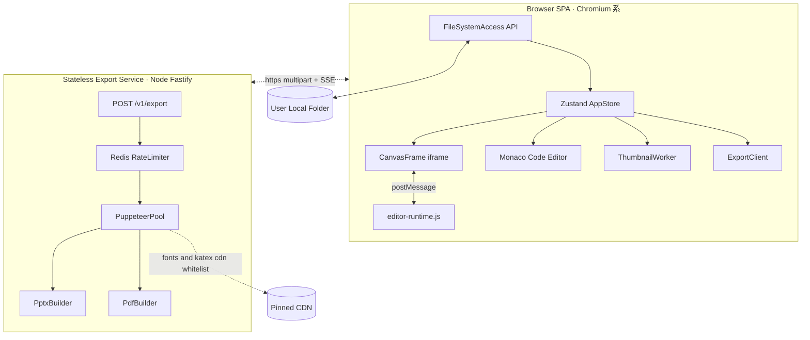
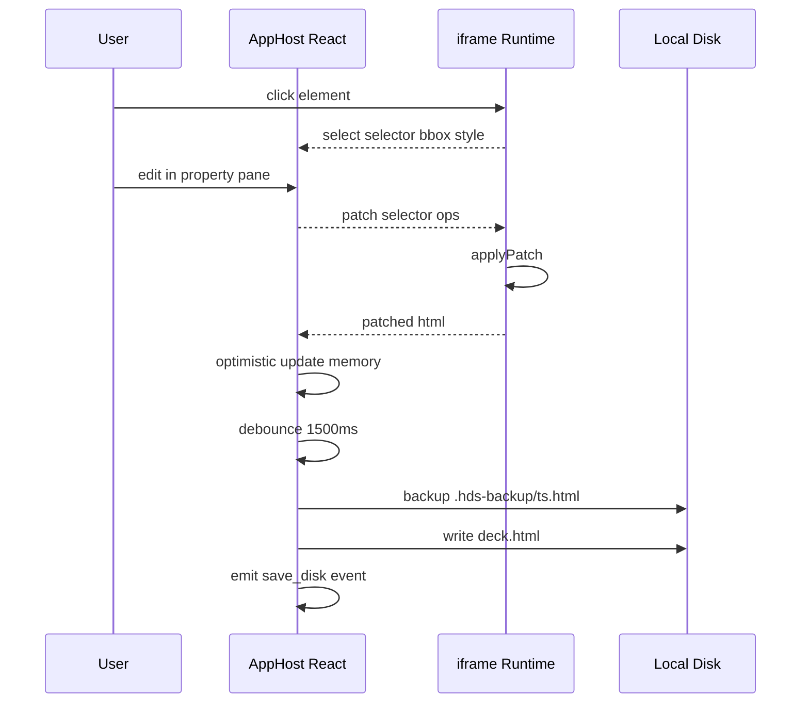
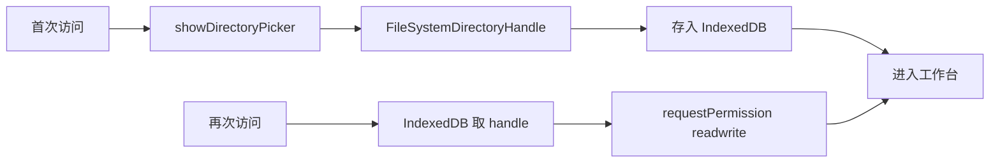
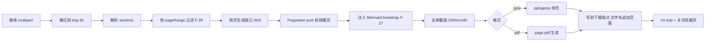
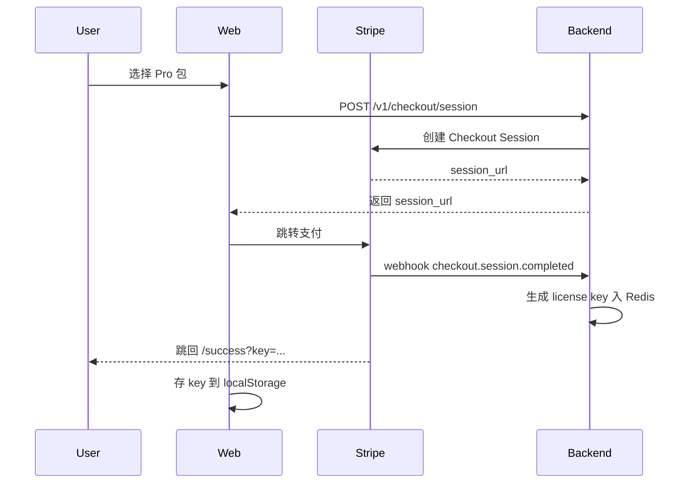
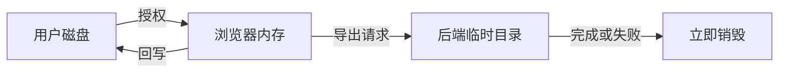

# HTML Deck Studio · 技术方案文档（TRD）

| 字段 | 内容 |
| --- | --- |
| 文档版本 | v0.1 (Draft) |
| 发布日期 | 2026-05-28 |
| 文档状态 | 评审中 |
| 架构负责人 | TBD |
| 关联文档 | [PRD.md](PRD.md) · [README.md](README.md) |
| 适用范围 | M1 MVP（详）+ M2/M3/M4 演进（概要） |

> 本文档与 [PRD.md](PRD.md) 一一对应。功能编号 F-xx、里程碑 M1–M4、模块/术语命名与 PRD 保持一致。

---

## 1. 系统总览

### 1.1 一句话技术定位

> 一个纯 Web SPA + 无状态导出服务的极简两段式架构。前端经 File System Access API 直读写用户本地目录；后端仅在 PPT/PDF 导出请求时短暂接收文件、跑无头 Chromium、回吐产物并销毁。

### 1.2 顶层架构图



### 1.3 设计原则

1. **前重后轻**：编辑全部在浏览器完成；后端只在导出时介入。
2. **零持久化**：后端任何请求都不写入数据库或对象存储；用户文件只在临时目录驻留分钟级。
3. **可水平扩容**：导出服务无状态，按 CPU 利用率横向扩容。
4. **协议先行**：HDS Slide Protocol、postMessage 协议、Export 协议三套接口先定义、后实现。
5. **可观测**：所有跨进程边界事件都有 trace id 串联。

---

## 2. 技术选型与理由

### 2.1 前端

| 选型 | 版本 | 理由 |
| --- | --- | --- |
| React | 18.x | 团队最熟，生态稳 |
| TypeScript | 5.x | 类型安全；postMessage 协议需要强类型 |
| Vite | 5.x | 启动快，构建产物体积小 |
| Tailwind CSS | 3.x | 工具站 UI 量不大，原子化够用 |
| shadcn/ui | 最新 | 抽屉/弹层/Toast 直接复用 |
| Zustand | 4.x | 轻量，无须 Redux 的 boilerplate |
| Monaco Editor | 0.45 | 代码模式必备 |
| Workbox | 7.x | PWA 离线可访问 marketing 页 |
| Sentry SDK | 7.x | 错误上报 |
| PostHog JS | 最新 | 匿名埋点 |

### 2.2 后端

| 选型 | 版本 | 理由 |
| --- | --- | --- |
| Node | 20 LTS | Puppeteer 兼容性最佳 |
| Fastify | 4.x | 轻量、高性能、内置 schema 校验 |
| Puppeteer | 22.x | 内置 Chromium，跨平台稳定 |
| pptxgenjs | 3.12+ | 纯 JS 生成 PPTX，免装 LibreOffice |
| sharp | 0.33+ | PNG 处理（裁剪、压缩） |
| ioredis | 5.x | 限流计数 |
| Pino | 9.x | 结构化日志 |
| OpenTelemetry | 1.x | 链路追踪 |

### 2.3 基础设施

| 用途 | 选型 | 理由 |
| --- | --- | --- |
| 前端托管 | Cloudflare Pages | 免费层够用、全球 CDN |
| 后端容器 | Fly.io（首选） / 自托管 K8s | 按地区就近导出 |
| 限流 / 缓存 | Upstash Redis | Serverless，按用量计费 |
| 验证码 | Cloudflare Turnstile | 无感、隐私友好 |
| 支付（M3） | Stripe Checkout | 法币标准 |
| 错误追踪 | Sentry SaaS | 生态完整 |
| 埋点 | PostHog Cloud（M1）→ Self-host（M3） | 演进式 |

---

## 3. HDS Slide Protocol v1

### 3.1 设计目标

- 与现有 AI 工具产出兼容（Cursor / Claude / ChatGPT 通常默认产出 `<section class="slide">` 结构）
- 不依赖任何运行时库
- 浏览器可直接打开预览
- 解析与导出可独立完成

### 3.2 规范

```html
<!doctype html>
<html lang="zh-CN">
  <head>
    <meta charset="UTF-8" />
    <title>Deck Title</title>
    <link rel="stylesheet" href="..." />
    <style>
      .slide { width:1280px; height:720px; overflow:hidden; }
    </style>
  </head>
  <body>
    <section class="slide" data-page-id="01H..." data-page="1">
      <!-- 任意 HTML 内容 -->
    </section>
    <section class="slide" data-page-id="01H..." data-page="2">
      ...
    </section>
  </body>
</html>
```

强约束：

- 每页必须是 **`<section>` 标签 + 含 `slide` 的 class**
- 页内尺寸固定 1280×720（CSS px），`overflow:hidden`
- 资源使用相对路径（图片、字体、CSS）
- `data-page-id` 是 ULID/UUID；缺失时由我方自动补齐
- `data-page` 是从 1 开始的当前序号；排序变更时自动更新

弱约束：

- 推荐根 `<body>` 不引入会修改全局布局的脚本
- 推荐使用 CDN 上的 KaTeX / Google Fonts，否则需自带

### 3.3 兼容性容错

| 情况 | 处理 |
| --- | --- |
| 无 `data-page-id` | 解析时生成 ULID 并写回 |
| 多个 HTML 含 slide | 选第一个；提供下拉手动切换 |
| 子节点是 `<div class="slide">` | 兼容识别，导出时不改原结构 |
| 引入 `<script>` | 编辑期阻断执行，导出期允许 |
| 含 iframe / video | 截图按原样捕获 |

### 3.4 元数据文件（可选）

`deck.meta.json` 位于 `deck.html` 同级，缺省时自动生成：

```json
{
  "version": 1,
  "title": "双层链状与环状网络的一致性分析与优化",
  "author": "陈智豪",
  "createdAt": "2026-05-28T10:00:00Z",
  "updatedAt": "2026-05-28T10:00:00Z",
  "slides": [
    { "id": "01HXR0...", "ordinal": 1, "chapter": "0" }
  ],
  "assets": [
    { "path": "assets/16-1.png", "sha1": "..." }
  ]
}
```

`deck.meta.json` 不参与编辑权威性判断（HTML 才是 source of truth），仅供性能优化与历史追溯。

---

## 4. 编辑器架构

### 4.1 三件套

| 组件 | 运行环境 | 职责 |
| --- | --- | --- |
| AppHost | 主页面（同源） | 状态管理、UI、文件读写、与 backend 交互 |
| CanvasFrame | iframe（`srcdoc` 注入） | 渲染当前页 HTML，挂载 editor-runtime.js |
| editor-runtime.js | iframe 上下文内 | 监听点击、应用 patch、序列化 DOM |

两者间通讯走 `window.postMessage`，强类型协议见下。

### 4.2 通讯协议（postMessage Schema）

```typescript
type EditorMessage =
  | { type: 'init'; sectionHtml: string; assetsBaseUrl: string }
  | { type: 'ready' }
  | { type: 'select'; selector: string; bbox: DOMRect; styleSnapshot: StyleSnapshot }
  | { type: 'clear-select' }
  | { type: 'patch'; selector: string; ops: PatchOp[] }
  | { type: 'patched'; html: string }
  | { type: 'request-html' }
  | { type: 'response-html'; html: string }
  | { type: 'error'; code: string; message: string };

type PatchOp =
  | { kind: 'text'; value: string }
  | { kind: 'attr'; name: string; value: string | null }
  | { kind: 'style'; name: string; value: string | null }
  | { kind: 'class'; add?: string[]; remove?: string[] };
```

设计要点：

- selector 用 runtime 生成的 **稳定 CSS path**（含 `nth-of-type`），避免与用户 class 冲突
- patch 是**原子操作集合**，runtime 内单次事务应用，失败回滚
- `request-html` / `response-html` 用于代码模式同步与导出前快照

### 4.3 选区与稳定选择器

- runtime 给每个可见元素挂载隐式 `data-hds-id`（不写回原 HTML）
- 选区时通过 `data-hds-id` + CSS path 双通道定位，AppHost 仅持有 path
- 同源沙箱：iframe `srcdoc` + CSP `script-src 'self'`，外部脚本仍可加载（KaTeX/字体白名单）

### 4.4 编辑事务流程



### 4.5 代码模式

- 顶栏切换至代码模式时：
  1. 向 runtime `request-html`，拿到当前页序列化后的 HTML
  2. 注入 Monaco（语言 html）
  3. 用户编辑保存 → 校验是否仍包含 `<section class="slide">` 根
  4. 校验通过 → 调用 runtime `init` 重新挂载该页
- 双向同步策略：代码 → 画布单向覆写（更安全）；画布 → 代码自动镜像但允许"丢弃画布改动"

### 4.6 撤销栈

- 页内撤销：Zustand 内存栈（最多 100 步），Cmd+Z / Cmd+Shift+Z
- 文件级撤销：走 `.hds-backup/` 历史抽屉（M2 上线）

---

## 5. 本地文件读写

### 5.1 授权与恢复



- IndexedDB 表 `recent_handles`：`{id, name, handle, lastOpenedAt}`
- 重新打开时 `verifyPermission`，若被收回则提示用户重新授权
- 不持久化任何文件内容到浏览器存储（只存 handle 引用）

### 5.2 文件夹结构（用户磁盘）

```
my-deck/
├── deck.html                # 主文件（source of truth）
├── deck.meta.json           # 可选元数据（自动生成/更新）
├── assets/                  # 图片、字体等资源
│   ├── 16-1.png
│   └── ...
└── .hds-backup/             # 我方自动写入的快照
    ├── 2026-05-28T10-00-12.html
    ├── 2026-05-28T10-02-45.html
    └── ...
```

### 5.3 读取流程

```typescript
async function openDeck(dirHandle: FileSystemDirectoryHandle) {
  const htmlEntry = await findFirstDeckHtml(dirHandle);
  const htmlText = await readText(htmlEntry);
  const doc = new DOMParser().parseFromString(htmlText, 'text/html');
  const sections = Array.from(doc.querySelectorAll('section.slide'));
  ensurePageIds(sections);
  const meta = await readOptionalMeta(dirHandle);
  return { doc, sections, meta, dirHandle };
}
```

### 5.4 写盘策略

- 触发：任意编辑事务完成 → debounce 1.5s
- 步骤（伪代码）：
  ```typescript
  async function commit(doc: Document, dirHandle: FileSystemDirectoryHandle) {
    const html = '<!doctype html>\n' + doc.documentElement.outerHTML;
    await writeBackup(dirHandle, html);             // 写 .hds-backup/<ts>.html
    await writeAtomic(dirHandle, 'deck.html', html); // 临时文件 + rename
    await updateMeta(dirHandle, meta);
  }
  ```
- 写盘失败：弹错（可能权限被撤），让用户选「重新授权」或「下载副本」

### 5.5 备份策略

- 每次写盘前先把上一版另存到 `.hds-backup/<ISO-ts>.html`
- 数量上限 50；超出后按创建时间淘汰
- M2 历史抽屉可：预览 / 对比 / 还原 / 删除

### 5.6 资源管理

- 图片替换时：把新文件写入 `assets/`；如果原 `` 在 `assets/` 之外，提示用户「将拷贝到 assets/」
- 检测孤儿资源：M2 提供"清理未引用资源"按钮

---

## 6. 渲染与样式隔离

### 6.1 iframe 沙箱

```html
<iframe
  sandbox="allow-same-origin allow-scripts allow-fonts"
  src="about:blank"
></iframe>
```

- `allow-same-origin` 让我们能反查 DOM；同时 srcdoc 注入避免主域 cookie 泄漏
- 编辑期 runtime 主动 `disableUserScripts()`：将原 HTML 中的 `<script>` 暂时改为 `<template>`，导出时恢复

### 6.2 资源解析

- 编辑期：iframe `srcdoc` 注入时设置 `<base href="blob:...">`，相对路径资源通过 service-worker 拦截、解析 handle 后回吐
- 导出期：后端临时目录解压后，注入 `<base href="file:///tmp/.../">`，直接走文件系统

### 6.3 字体与 KaTeX

- 默认加载 Google Fonts、KaTeX CDN
- 后端 Chromium 启动时拉取 KaTeX 离线包到容器镜像（构建时打包），避免运行时网络抖动
- 等待 `await document.fonts.ready` + `await new Promise(r => requestIdleCallback(r))` 后再截图

### 6.4 CSP

```
default-src 'self';
script-src 'self' 'unsafe-inline' https://cdn.jsdelivr.net;
style-src 'self' 'unsafe-inline' https://cdn.jsdelivr.net https://fonts.googleapis.com;
font-src 'self' data: https://fonts.gstatic.com https://cdn.jsdelivr.net;
img-src 'self' data: blob:;
frame-src 'self' blob:;
connect-src 'self' https://api.htmldeck.studio https://*.posthog.com https://*.sentry.io;
```

CDN 白名单仅 jsDelivr / Google Fonts；其它 CDN 警告但不阻断。

### 6.5 Mermaid 即时渲染（对应 PRD F-27）

> 目标：让用户原样写 Mermaid 源码，无需事先转 SVG，编辑期实时预览、导出期视觉一致。

#### 6.5.1 识别规则

满足以下任一即认定为 Mermaid 节点：

- `<pre class="mermaid">...</pre>`
- `<div class="mermaid">...</div>`
- 任意带 `data-mermaid` 属性的元素（值不参与匹配）

匹配时区分大小写但容忍空白与额外 class（`class="mermaid foo bar"` 同样命中）。

#### 6.5.2 编辑期渲染

- 进入工作台后，runtime 通过 jsDelivr 懒加载 mermaid v10：

  ```typescript
  const mermaid = await import('https://cdn.jsdelivr.net/npm/mermaid@10/dist/mermaid.esm.min.mjs');
  mermaid.default.initialize({ startOnLoad: false, theme: 'default', securityLevel: 'strict' });
  ```

- 节点首次出现：调用 `mermaid.run({ nodes: [el] })`，渲染产物以 `<svg>` 替换原节点内部，同时把源码缓存到 `el.dataset.mermaidSource`，并在容器外层加 `data-mermaid-rendered="true"`
- 文本编辑（contenteditable）：用户实际编辑的是 `data-mermaid-source`（运行时反向暴露成 textarea-like editor），离焦后 debounce 300ms 重新 `mermaid.run`
- 代码模式下用户直接改源码 → 切回视觉模式 → runtime 重新执行渲染

#### 6.5.3 导出期渲染

后端 Puppeteer 流水线在 §8.2 `wrap` 步骤注入 Mermaid bootstrap 脚本，并在截图前等待：

```typescript
await page.evaluate(async () => {
  if (!window.mermaid) {
    const mod = await import('https://cdn.jsdelivr.net/npm/mermaid@10/dist/mermaid.esm.min.mjs');
    window.mermaid = mod.default;
    window.mermaid.initialize({ startOnLoad: false, theme: 'default', securityLevel: 'strict' });
  }
  const nodes = document.querySelectorAll(
    'pre.mermaid:not([data-mermaid-rendered]), div.mermaid:not([data-mermaid-rendered]), [data-mermaid]:not([data-mermaid-rendered])',
  );
  if (nodes.length === 0) return;
  await window.mermaid.run({ nodes: Array.from(nodes) });
});
await page.evaluate(async () => {
  // 等待所有 Mermaid 节点都已经渲染或失败标记
  await new Promise<void>((resolve) => {
    const check = () => {
      const all = document.querySelectorAll('pre.mermaid, div.mermaid, [data-mermaid]');
      const done = Array.from(all).every(
        (el) => el.hasAttribute('data-mermaid-rendered') || el.hasAttribute('data-mermaid-error'),
      );
      if (done) resolve();
      else requestAnimationFrame(check);
    };
    check();
  });
});
await page.evaluate(() => document.fonts.ready);
```

容器镜像离线打包 `mermaid@10` 与中文字体子集，避免运行时网络抖动。

#### 6.5.4 错误兜底

- 渲染失败的节点：runtime 给容器加 `data-mermaid-error="<msg>"`，并显示浅红边框 + 占位说明
- 不阻断其他节点 / 不阻断导出
- 用户在代码模式可看到原始报错位置（Monaco diagnostics 标注）

#### 6.5.5 安全

- `securityLevel: 'strict'`，禁止 HTML 注入
- 不允许用户在 Mermaid 节点里通过 `%%{init: {...}}%%` 设置 `securityLevel` / `htmlLabels: true`（runtime 在 sanitize 阶段剥离）
- 主题强制 default；自定义主题在 v2 评估

---

## 7. 数据模型

### 7.1 浏览器内（Zustand）

```typescript
interface AppStore {
  dirHandle?: FileSystemDirectoryHandle;
  deck?: {
    htmlPath: string;
    doc: Document;
    sections: Section[];
    meta: DeckMeta;
  };
  currentSlideId?: string;
  selection?: { selector: string; bbox: DOMRect; style: StyleSnapshot };
  pendingSaveAt?: number;
  history: { undo: Patch[]; redo: Patch[] };
}

interface Section {
  id: string;          // data-page-id
  ordinal: number;     // data-page
  element: HTMLElement;
  thumbnail?: string;  // dataURL
}

interface DeckMeta {
  version: 1;
  title?: string;
  author?: string;
  createdAt?: string;
  updatedAt?: string;
  slides: { id: string; ordinal: number; chapter?: string }[];
  assets: { path: string; sha1: string }[];
}
```

### 7.2 IndexedDB（仅句柄引用）

```
table: recent_handles
columns: id, name, handle, lastOpenedAt
table: session_meta
columns: id, lastSlideId, zoomLevel, viewMode
```

不存任何文件内容；纯 UX 用，方便重启后恢复。

### 7.3 后端（导出请求生命周期内）

- 临时目录 `/tmp/hds-<uuid>/`：解压上传内容
- 仅在请求生命周期内存在，结束（成功 / 失败 / 超时）即 `rm -rf`
- 不写入任何持久化存储

---

## 8. 导出引擎

### 8.1 端到端协议

**Request**

```
POST /v1/export
Content-Type: multipart/form-data
X-HDS-Trace-Id: <uuid>

fields:
  format     = "pptx" | "pdf"
  resolution = "1280x720@2x" | "1920x1080@2x" | "3840x2160@2x"
  watermark  = "on" | "off"
  meta       = JSON { title, author }
  pageRange  = "all" | "current" | "1,3-5,8"   # F-28，缺省 "all"
files:
  deck.html
  assets/*  (可选多文件，原结构上传)
```

`pageRange` 规则（对应 PRD F-28）：

- `"all"`：全部页（默认）
- `"current"`：仅当前选中页（前端把页码塞进 `meta.currentOrdinal` 字段）
- 自定义：`,` 分隔的页码或页码区间（`-` 表示闭区间），如 `1,3-5,8`；解析后去重排序
- 超出范围或非法字符：返回 `400`，错误码 `EXPORT_RANGE_INVALID`

**Response**

- 默认走 `Content-Type: text/event-stream`（SSE）上报进度：

  ```
  event: progress
  data: {"current": 7, "total": 21, "phase": "screenshot"}
  ```

- 完成事件：

  ```
  event: done
  data: {"url": "/v1/export/<token>/download"}
  ```

- 下载端点单次有效（5 分钟）；下载完成立即销毁文件

### 8.2 后端流水线



文件名约定（F-28）：

- 全部页：`<deckTitle>.pptx`
- 单页：`<deckTitle>-p<N>.pptx`
- 多页/区间：`<deckTitle>-p<min>-<max>.pptx`（如 `deck-p3-5.pptx`）
- PDF 同规则。

### 8.3 关键代码片段（伪代码）

```typescript
// 切片与包壳
function splitSlides(html: string, baseHref: string): string[] {
  const doc = parse(html);
  const head = doc.querySelector('head')!.innerHTML;
  return Array.from(doc.querySelectorAll('section.slide')).map(
    (sec) => `
<!doctype html><html><head>
  <base href="${baseHref}">
  ${head}
  <style>html,body{margin:0;background:#fff;} .slide{margin:0;}</style>
</head><body>${sec.outerHTML}</body></html>`,
  );
}

// 截图
async function snapshot(html: string, page: Page) {
  await page.setViewport({ width: 1280, height: 720, deviceScaleFactor: 2 });
  await page.setContent(html, { waitUntil: 'networkidle0' });
  await page.evaluate(() => document.fonts.ready);
  await page.evaluate(
    () => new Promise<void>((r) => requestIdleCallback(() => r(), { timeout: 1500 })),
  );
  return await page.screenshot({ type: 'png', clip: { x: 0, y: 0, width: 1280, height: 720 } });
}

// PPTX 组装
function buildPptx(pngs: Buffer[], meta: DeckMeta) {
  const pres = new PptxGenJS();
  pres.layout = 'LAYOUT_WIDE';
  pres.title = meta.title;
  pres.author = meta.author;
  pngs.forEach((png) => {
    const slide = pres.addSlide();
    slide.addImage({ data: 'data:image/png;base64,' + png.toString('base64'), x: 0, y: 0, w: 13.33, h: 7.5 });
  });
  return pres.write('nodebuffer');
}
```

### 8.4 性能预算

| 阶段 | 21 页 P50 | 21 页 P95 |
| --- | --- | --- |
| 上传 + 解压 | 2s | 5s |
| 启浏览器（池命中） | 0s | 1s |
| 截图 21 页（并发 3） | 18s | 30s |
| PPTX 组装 | 1s | 3s |
| 下载 | 2s | 5s |
| **总** | 23s | 45s |

### 8.5 Puppeteer 池

```typescript
class PuppeteerPool {
  private browsers: Browser[] = [];
  private capacity = CPU_COUNT - 1;
  async withPage<T>(fn: (page: Page) => Promise<T>): Promise<T> {
    const browser = await this.acquire();
    const context = await browser.createBrowserContext();
    const page = await context.newPage();
    try {
      return await fn(page);
    } finally {
      await context.close();
      this.release(browser);
    }
  }
}
```

- 每页用独立 `BrowserContext`，避免污染
- 浏览器空闲 5 分钟自动关闭释放内存
- 单页 60s 超时强制 kill

### 8.6 水印

- Free 用户在每页右下角叠加 `htmldeck.studio` 小字水印
- 后端在截图后用 sharp 合成水印（不修改 DOM，避免 KaTeX 重排）

---

## 9. 计费与配额（M3）

### 9.1 配额规则

| 用户类型 | 每日限额 | 来源 |
| --- | --- | --- |
| 匿名 IP | 3 次 | Redis IP key |
| Pro 包 license key | 剩余额度 | Redis license key |
| Pro 月 license key | 无限 | Redis 标记 unlimited |

### 9.2 限流实现

- 中间件层 Redis：`ratelimit:{ip}:{yyyymmdd}` INCR + EXPIRE 24h
- 超额返回 `429`，附 paywall payload：`{ next_reset_at, upgrade_url }`
- license key 走另一套：`license:{key}` -> `{ plan, remaining, expiresAt }`

### 9.3 Stripe Checkout 流程



### 9.4 防滥用

- 注册需 Turnstile 验证（Free 用户首次导出）
- 同 IP 超过 50 次/24h 强制人机校验
- 检测异常 UA / headless 调用直接拒绝

---

## 10. 安全与隐私

### 10.1 数据生命周期



明确承诺：

- 用户编辑过程数据**不离开本机**
- 导出过程数据驻留临时目录平均 < 60s
- 任何阶段都不进数据库 / 对象存储

### 10.2 后端隔离

- 每个导出请求在独立 Linux 命名空间内执行
- 临时目录使用 `mkdtemp` + 进程退出 hook `rm -rf`
- Puppeteer 启动参数：`--no-sandbox=false --disable-dev-shm-usage --disable-features=Translate`
- 容器无外网访问，仅白名单 jsDelivr / Google Fonts
- 镜像中预置 KaTeX / Noto Sans SC / Inter / Fira Code，减少出站请求

### 10.3 浏览器侧

- File System Access 权限只用于编辑期；导出走单次上传，不复用 handle
- 防 XSS：iframe sandbox + CSP；属性面板写回时对 `value` 做严格转义
- 防 SSRF：编辑期资源加载仅 srcdoc 内的 base，禁外部 URL 通过我方代理

### 10.4 密钥管理

- 服务端 `STRIPE_SECRET_KEY`、`REDIS_PASSWORD`、`OTEL_TOKEN` 通过 Fly.io secret
- 不在前端暴露任何密钥；license key 是单向"消耗券"，泄漏只影响该用户

### 10.5 合规

- 隐私政策 / 服务条款：M1 上线前由法务复核
- Cookie：仅 functional（PostHog 匿名）+ 鉴权（M3 起 license key）
- GDPR：提供「立即清除我浏览器内所有数据」按钮（清 IndexedDB + localStorage）

---

## 11. 可观测性

### 11.1 trace id 串联

- 前端在每次导出请求时生成 `X-HDS-Trace-Id`，写入 SSE 事件、Sentry breadcrumb、PostHog 事件
- 后端 OTel 把同一 trace id 贯穿 Fastify → Puppeteer 各 span

### 11.2 关键 metric

| Metric | 类型 | 描述 |
| --- | --- | --- |
| `export.duration_ms` | histogram | 单次导出耗时 |
| `export.success_rate` | gauge | 5 分钟成功率 |
| `puppeteer.pool.utilization` | gauge | 池占用率 |
| `ratelimit.rejected` | counter | 限流拒绝次数 |
| `screenshot.timeout` | counter | 单页截图超时数 |

### 11.3 告警

- `export.success_rate < 95%` 持续 5 分钟 → PagerDuty
- `puppeteer.pool.utilization > 0.9` 持续 10 分钟 → 触发扩容

### 11.4 日志结构

```json
{
  "ts": "2026-05-28T10:01:23.456Z",
  "level": "info",
  "trace_id": "01HXR...",
  "event": "export.start",
  "format": "pptx",
  "slides": 21,
  "ip_hash": "..."
}
```

只记 hash 后的 IP，不存原始 IP。

---

## 12. 测试策略

### 12.1 单元测试

- 选区生成器：`buildStableSelector(node)` 给定 DOM 应返回唯一稳定路径
- patch 应用器：op 顺序与回滚正确性
- HDS 解析器：各种容错样本（带 `<div class="slide">`、缺 `data-page-id` 等）

### 12.2 集成测试（前端 Playwright）

- e2e: 打开样例目录 → 编辑 3 段文字 + 1 张图 → 导出 PPTX → 校验下载文件存在且 > 100KB
- e2e: 撤销/重做覆盖文本/属性/图片三类操作
- e2e: 关闭页面后重新打开，IndexedDB 应自动恢复

### 12.3 视觉回归

- 用 sample deck 在 CI 中执行后端导出 → 每页 PNG 与 baseline 做 diff（pixelmatch）
- 阈值：单像素差异 < 0.3%

### 12.4 性能压测

- k6 模拟 50 并发导出 21 页 deck
- 目标：P95 < 60s，错误率 < 1%

### 12.5 兼容性

- BrowserStack 矩阵：Chrome / Edge / Brave / Arc / Opera 各最新 + 上一版
- Safari / Firefox 仅验证降级提示正确

---

## 13. 发布与运维

### 13.1 环境

| 环境 | 域名 | 用途 |
| --- | --- | --- |
| local | localhost | 开发 |
| preview | preview.htmldeck.studio | PR 部署 |
| staging | staging.htmldeck.studio | 集成 |
| production | htmldeck.studio | 生产 |

### 13.2 CI/CD

- GitHub Actions：lint → typecheck → unit → e2e → 视觉回归
- 合入 main 自动部署到 staging
- 手动触发 production，且需 sign-off
- 前端 Cloudflare Pages：每次 commit 一个 preview URL
- 后端：Docker → Fly.io；image 复用 KaTeX/字体离线包

### 13.3 灰度

- 后端按 `X-HDS-Trace-Id % 100 < N` 路由到新版本
- 前端通过 Cloudflare Workers 按 cookie 灰度

### 13.4 回滚

- 前端：Cloudflare Pages 一键回滚到上版 commit
- 后端：Fly.io `release rollback`；DB 无状态无需迁移

### 13.5 监控大盘

- Grafana 仪表盘：导出耗时、成功率、池占用、限流拒绝
- 周报：导出次数、付费转化、错误 Top 10

---

## 14. 模块清单与所有制（owner-ship）

| 模块 | 路径（建议） | Owner | M1 完工标准 |
| --- | --- | --- | --- |
| AppHost | `apps/web/src/app/` | FE Lead | 三栏布局可路由 |
| CanvasFrame | `apps/web/src/canvas/` | FE | iframe 加载 + postMessage 双向 |
| editor-runtime | `apps/web/src/runtime/` | FE | 选区 / patch / 序列化 |
| File System Adapter | `apps/web/src/fs/` | FE | 读写 + 备份 + 权限恢复 |
| Property Pane | `apps/web/src/panel/` | FE | F-07 全字段 |
| Code Mode | `apps/web/src/code/` | FE | Monaco + 双向同步 |
| Export Client | `apps/web/src/export/` | FE | 上传 + SSE + 下载 |
| Export API | `apps/api/src/export/` | BE Lead | F-14/F-15 完整 |
| Puppeteer Pool | `apps/api/src/pool/` | BE | 池管理 + 监控 |
| Pptx Builder | `apps/api/src/pptx/` | BE | pptxgenjs 包装 |
| Pdf Builder | `apps/api/src/pdf/` | BE | page.pdf 包装 |
| Rate Limiter | `apps/api/src/limit/` | BE | Redis 限流 + Turnstile |
| Telemetry | `packages/telemetry/` | DevOps | OTel + Pino + Sentry |
| Marketing | `apps/marketing/` | FE/设计 | 首页、定价、FAQ |

---

## 15. 风险与备选方案

| 风险 | 备选方案 |
| --- | --- |
| File System Access API 长期不进 Safari/Firefox | M2 起强化 ZIP 流（直接 PR 化为一等公民） |
| Puppeteer 内存泄漏 | 切换 Playwright + Chromium，或定时重启浏览器进程 |
| pptxgenjs 大图崩 | 走 Python 子进程 `python-pptx`（已验证稳定，见 `/Users/zm00107ml/Downloads/figures/html_to_pptx.py`） |
| KaTeX 渲染时机不稳 | 显式 hook：等待 `katex-rendered` data-attribute 出现 |
| 用户 deck 内含外部网络资源 | 编辑期 service worker 拦截 + 提示用户离线缓存；导出期容器加白名单 |
| 浏览器拒绝大目录授权 | 提示用户最小化目录（仅 deck.html + assets/） |
| 服务端 cost 失控（导出 CPU 重） | 引入 Cloudflare R2 缓存 + 短链 token，重复导出秒命中 |
| 用户希望可编辑 PPTX（非图片型） | 标记为 P2，在 M4 引入"结构化模式 beta"，让 AI 工具按约定 schema 出 HTML，后端按 schema 拆成原生 PPT 对象 |

---

## 附录 A：与现有 demo 的兼容性核对

现有 `/Users/zm00107ml/Downloads/figures/bilayer-network-slides.html`（21 页）满足以下条件，可作为 M1 验收用例：

- ✅ `.slide` 容器 1280×720
- ✅ `<section class="slide" data-page="N">`
- ✅ KaTeX 通过 jsDelivr CDN
- ✅ 字体走 Google Fonts
- ✅ 资源相对路径
- ⚠️ 缺 `data-page-id`，M1 自动补全
- ⚠️ 部分页面有内联 `<style>`、`<svg>` 元素，需校验编辑器无破坏

附录 B 给出对该 demo 完整解析后的 `deck.meta.json` 范例（略，由实现期自动产出）。

---

## 附录 B：路线图与 PRD 的双向追溯

| PRD 功能 | TRD 章节 | 备注 |
| --- | --- | --- |
| F-01 文件夹入口 | §5 本地文件读写 | |
| F-03 切片识别 | §3 HDS Slide Protocol | |
| F-06 内联编辑 | §4 编辑器架构 | |
| F-07 属性面板 | §4.2 patch 协议 | |
| F-08 图片替换 | §5.6 资源管理 | |
| F-11 实时回写 | §5.4 写盘策略 | |
| F-12 自动备份 | §5.5 备份策略 | |
| F-14/F-15 导出 | §8 导出引擎 | |
| F-18 匿名额度 | §9 计费与配额 | |
| F-19 Stripe | §9.3 Checkout 流程 | M3 |
| F-22 兼容性提示 | §6 渲染 + §15 风险 | |
| F-27 Mermaid 兼容 | §6.5 Mermaid 即时渲染 | M1 |
| F-28 单页 / 范围导出 | §8.1 pageRange + §8.2 流水线 | M1 |

> 任何 PRD 新增功能，必须在 TRD 找到对应章节或在本附录显式声明"延后"。
